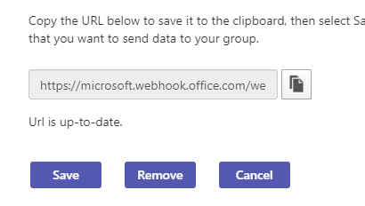

# Use Microsoft 365 and custom connectors in Microsoft Teams

Connectors keep your team current by delivering frequently used content and service updates directly into a channel. With connectors, your Microsoft Teams users can receive updates from popular services such as Trello, Wunderlist, GitHub, and Azure DevOps Services within the chat stream in their team.

Any member of a team can connect their team to popular cloud services with the connectors if the team permissions allow, and all team members are notified of activities from that service. Connectors will continue to function even after the member who has initially setup the connector has left. Any team member with the permissions to add\remove can modify connectors setup by other members.

Microsoft 365 connectors can be used with both Microsoft Teams and Microsoft 365 groups, making it easier for all members to stay in sync and receive relevant information quickly. Both Microsoft Teams and Exchange use the same connector model, which allows you to use the same connectors within both platforms. It is worth noting, however, that disabling connectors for the Microsoft 365 group that a team is dependent upon will disable the ability to create connectors for that team as well.

> [!NOTE]
> Connectors are disabled by default in GCC environments. If you need to enable them, set the ConnectorsEnabled or ConnectorsEnabledForTeams parameters to $true with the [Set-OrganizationConfig](/powershell/module/exchange/set-organizationconfig) cmdlet. You previously need to [connect to Exchange Online PowerShell](/powershell/exchange/connect-to-exchange-online-powershell).

> [!NOTE]
> Connectors are disabled by default in the Government Cloud Community (GCC) environments. If you need to enable them, set the ConnectorsEnabled or ConnectorsEnabledForTeams parameters to $true with the [SetOrganizationConfig](/powershell/module/exchange/set-organizationconfig?view=exchange-ps) cmdlet. You previously needed to connect to the [Exchange Online PowerShell](/powershell/exchange/connect-to-exchange-online-powershell?view=exchange-ps).

## Add a connector to a channel

Currently, you can add connectors by using Microsoft Teams desktop and web clients. However, information posted by these connectors can be viewed in **all clients** including mobile.

1. To add a connector to a channel, click the **ellipses (…),** on the right of a channel name, then click **Connectors**.

    > [!div class="mx-imgBorder"]
    > 

2. You can select from a variety of available connectors, and then click **Add**.

    > [!div class="mx-imgBorder"]
    > 

3. Fill in the required information of the selected connector and click **Save**. Each connector requires a diverse set of information to function properly, and some may require you to sign in to the service using the links provided on the connector configuration page.

    > [!div class="mx-imgBorder"]
    > 

4. Data provided by the connector is automatically posted to the channel.

    > [!div class="mx-imgBorder"]
    > 

<!---Delete this section after customer migration to new Webhook URL is complete--->
> [!IMPORTANT]
> **Connector URL update notification**
>
> The Teams connectors are transitioning to a new URL to enhance security. During the course of this transition, you will receive certain notifications to update your configured connector to use the new URL. It is strongly recommended that you update your connector immediately to prevent any disruption to connector services. The following steps need to be followed to update the URL:
> 1. In the connectors configuration page, an "Attention Required" message will be displayed under the "Manage" button for the connections that need to be updated.
> 
> 2. For incoming webhook connectors, users can recreate the connection by simply selecting **Update URL** and using the newly generated webhook URL.
> 
> 3. For other connector types, the user would need to remove the connector and recreate the connector configuration.
> 4. You will see a message "URL is up-to-date" after the URL has been successfully updated.
> 

## Develop custom connectors

You can also build custom connectors, as well as incoming and outgoing webhooks. See our [developer documentation](/microsoftteams/platform/webhooks-and-connectors/what-are-webhooks-and-connectors) for more information.
