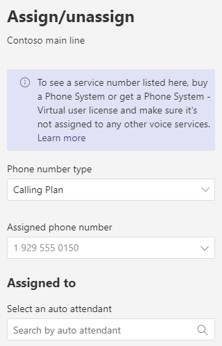

# Step 4: Set up a Business Voice resource account

Resource accounts aren't assigned to any specific user. Instead, resource accounts, which use a free virtual user license, are used by devices and services in Microsoft 365. In Microsoft Teams, resource accounts are assigned phone numbers and are then associated with auto attendants and call queues.

By associating resource accounts to auto attendants and call queues, you can add one or more toll or toll-free phone numbers to them. For example, you could associate one resource account with a toll number to an auto attendant for local callers. For long distance calls, you could associate another resource account with a toll-free number to the same auto attendant.

The sections in this article show you how to set up a resource account and then assign a phone number to it. Later on, you'll associate the resource account with an auto attendant.

The following video shows you how to complete these steps in the Teams admin center.

> [!VIDEO https://www.microsoft.com/videoplayer/embed/RE4OFYG]

## Obtain virtual user licenses

Resource accounts require a license in order to work with auto attendants and call queues. You can use a free *Microsoft 365 Phone System - Virtual User* license.

> [!NOTE]
> You should only need to perform the following steps if you've signed up for a Business Voice trial period. If you purchased Business Voice licenses, virtual licenses should already be applied to your account. 
>
> To see if you already have virtual licenses, log into Microsoft 365 using an account with Global admin permissions. Then go to Billing > [Your products](https://admin.microsoft.com/Adminportal/Home#/subscriptions). If you have virtual licenses, they'll appear as **Microsoft 365 Phone System - Virtual User**.

1. Open the Microsoft 365 admin center and log in with a user that is a Global admin (this is usually the account you used to sign up for Microsoft 365).
2. In the left navigation pane, go to <a href="https://admin.microsoft.com/Adminportal/Home#/catalog" target="_blank">**Billing** > **Purchase services**</a> > **Add-ons** > **See all Add-ons products**.
3. Scroll to the end to find the **Microsoft 365 Phone System – Virtual User** license. Select **Details**, then **Buy**.
4. On the license purchase page, select the number of virtual user licenses you want. You need one virtual license for each auto attendant and call queue you plan to set up. We recommend selecting at least five licenses so you can easily set up more auto attendants and call queues in the future without having to purchase more licenses right away.
5. Uncheck **Automatically assign to all of your users with no licenses**.
6. Select **Check out now**.
7. Confirm your order, select **Next**, and then **Place order**.

> [!NOTE]
> Keep in mind you must still  **Buy** the license even though it has a cost of zero.

## Create a resource account

After you've received your *Microsoft 365 Phone System - Virtual User* license, you can create your resource account.

1. Open the Microsoft Teams admin center and log in with a user that is a Global admin (this is usually the account you used to sign up for Microsoft 365).
2. In the left navigation pane, go to <a href="https://admin.teams.microsoft.com/company-wide-settings/resource-accounts" target="_blank">**Org-wide settings** > **Resource accounts**</a>.
3. Select **Add**.
4. In the **Add resource account** pane, fill out **Display name**, and then **Username**. Choose a descriptive display name such as "Main line auto attendant" to describe the purpose of the resource account.
5. In **Resource account type**, select **Auto attendant**.
6. Select **Save**.

## Assign a license

After you've created your resource account, you need to assign a *Microsoft 365 Phone System - Virtual User* license or *Phone System* license.

1. Open the Microsoft 365 admin center and log in with a user that is a Global admin (this is usually the account you used to sign up for Microsoft 365).
1. In the left navigation pane, go to <a href="https://admin.microsoft.com/Adminportal/Home#/users" target="_blank">**Users** > **Active users**</a>.
1. Select your resource account.
1. On the **Licenses and Apps** tab, under **Licenses**, select **Microsoft 365 Phone System - Virtual User**.
1. Select **Save changes** and then **Close**.

## Assign a service number

1. Open the Microsoft Teams admin center and log in with a user that is a Global admin (this is usually the account you used to sign up for Microsoft 365).
1. In the left navigation pane, go to <a href="https://admin.teams.microsoft.com/company-wide-settings/resource-accounts" target="_blank">**Org-wide settings** > **Resource accounts**</a>.
1. Select the resource account you just created, and then click **Assign/unassign**.
1. In the **Phone number type** dropdown, choose **Online**.
1. In the **Assigned phone number** box, search for the number you want to use and click **Add**. Be sure to include the country code (for example, **+1** 250 555 0012)
1. Click **Save**.

> [!div class="nextstepaction"]
> [Next step: Assign phone numbers to your users](set-up-assign-numbers.md)
