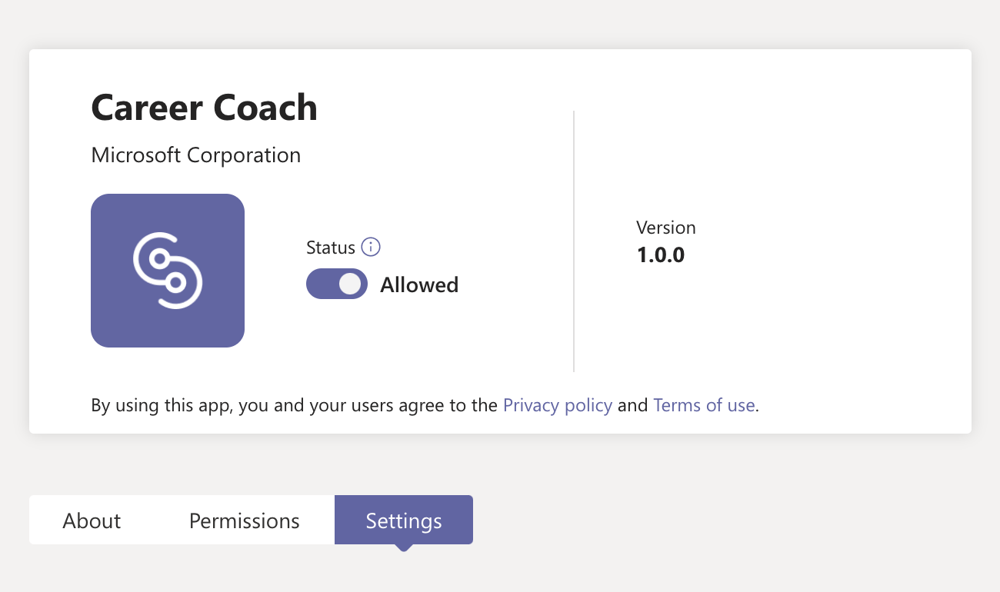
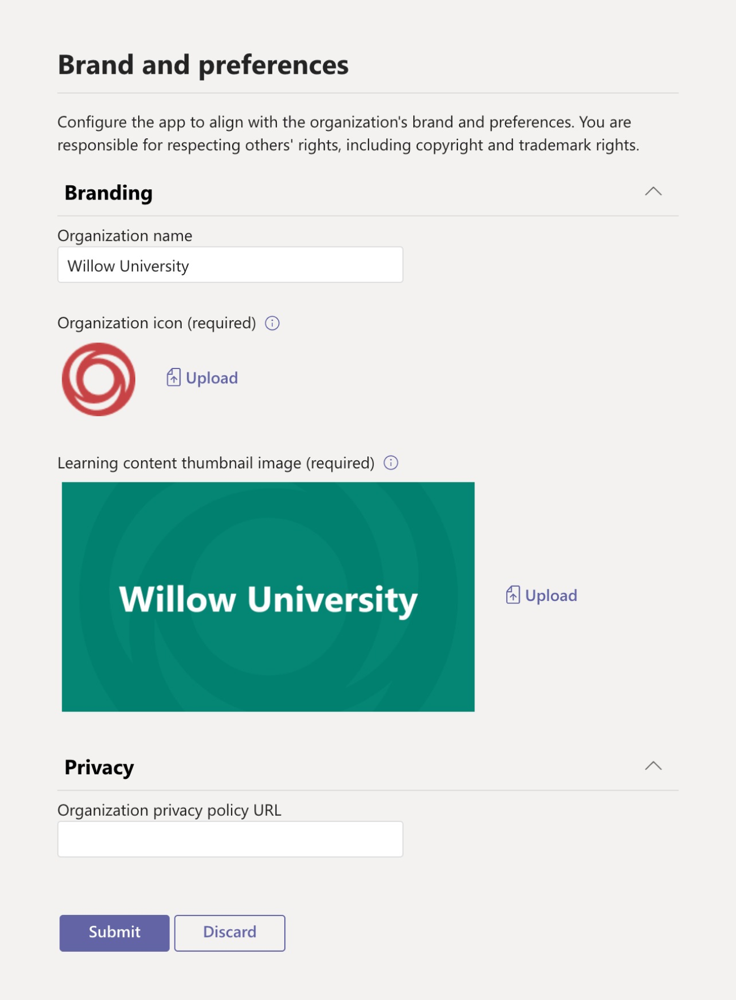
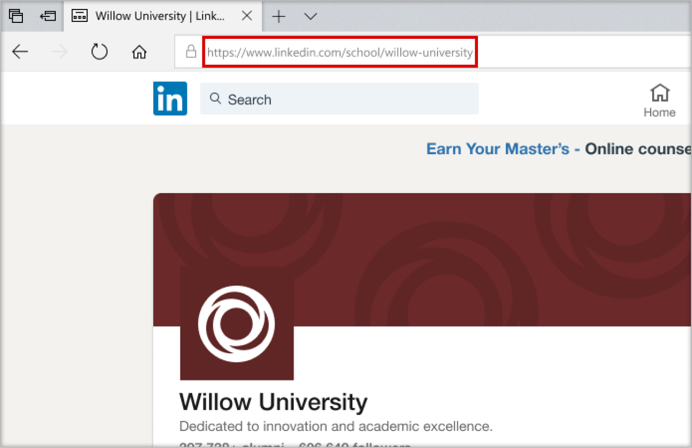
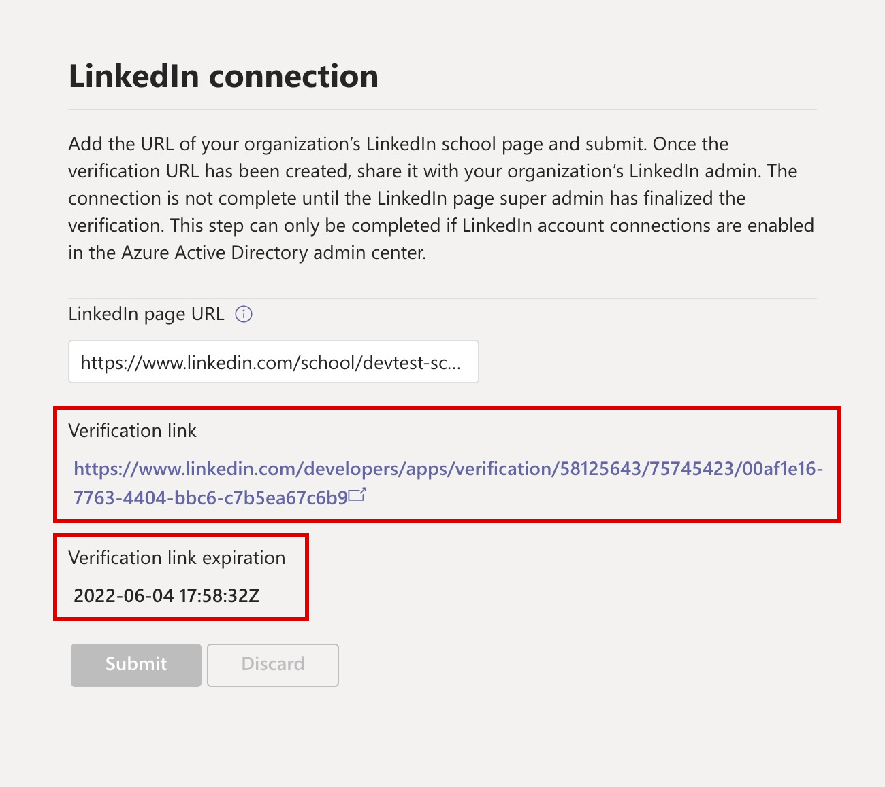
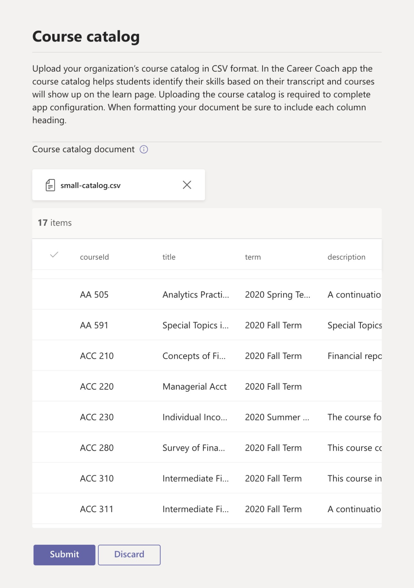
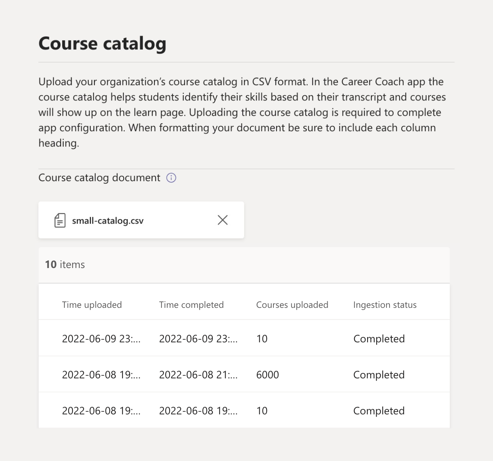

# Set up and configure Career Coach for Microsoft Teams

This article is for higher education IT admins to learn how to set up Career Coach for Microsoft Teams.

The primary steps to set up, configure, and release Career Coach are:

1. [Identify roles and permissions](#identify-roles-and-permissions).
1. [Step 1: Prepare your tenant for Career Coach](#step-1-prepare-your-microsoft-365-tenant-for-career-coach).
1. [Step 2: Purchase Career Coach licenses](#step-2-purchase-career-coach-licenses).
1. [Step 3: Access Career Coach settings](#step-3-access-the-career-coach-app-settings).
1. [Step 4: Set up and configure Career Coach settings](#step-4-configure-career-coach-settings).
1. [Step 5: Make Career Coach available to your institution](#step-5-making-career-coach-available-to-your-institution).

## Identify roles and permissions

Setting up Career Coach requires several types of admin roles. These roles and permissions may be assigned to one individual or may require collaboration with IT professionals in your educational institution. Use the checklist below to identify the individuals necessary to complete the referenced tasks.

You can check your account’s assigned roles by visiting the [Microsoft 365 admin center > Users > Active users](https://go.microsoft.com/fwlink/p/?linkid=834822) > Select your username to confirm your role.

Learn more about [admin roles in the Microsoft 365 admin center](/microsoft-365/admin/add-users/about-admin-roles).

### [Microsoft 365 admin center tasks](https://go.microsoft.com/fwlink/p/?linkid=2024339)

Role: [Global Administrator](/azure/active-directory/roles/permissions-reference#global-administrator)

Career Coach tasks:

- [Purchase licenses](#step-2-purchase-career-coach-licenses).
- [Assign licenses](#assign-career-coach-licenses-to-users).

### [Azure Active Directory admin center tasks](https://go.microsoft.com/fwlink/p/?linkid=2067268)

Role: [Global Administrator](/azure/active-directory/roles/permissions-reference#global-administrator)

Career Coach task:

- [Turn on LinkedIn account connections](#turn-on-linkedin-account-connections).

### [Teams admin center tasks](https://admin.teams.microsoft.com/dashboard)

Role: [Teams administrator](/azure/active-directory/roles/permissions-reference#teams-administrator)

Career Coach tasks:

- [Add Career Coach as an installed app](#add-career-coach-as-an-installed-app).
- [Configure the Career Coach app settings](#step-4-configure-career-coach-settings).
- [Setup policies](#setup-policies-and-pin-the-app).
- [Pin the app](#setup-policies-and-pin-the-app).

### LinkedIn developer portal tasks

Role: [LinkedIn School Page Super Admin](https://www.linkedin.com/help/linkedin/answer/a541981)

Career Coach task:

- [Verify the LinkedIn School Page](#verify-the-linkedin-school-page).

## Prepare for Career Coach

Before setting up and configuring Career Coach, follow these preparation steps.

1. [Step 1: Prepare your tenant for Career Coach](#step-1-prepare-your-microsoft-365-tenant-for-career-coach).
1. [Step 2: Purchase Career Coach licenses](#step-2-purchase-career-coach-licenses).

### Step 1: Prepare your Microsoft 365 tenant for Career Coach

#### Turn on LinkedIn account connections

There are two ways LinkedIn account connections are used by Career Coach:

- To allow students, faculty, and staff to connect their Microsoft 365 account to their LinkedIn account and [send LinkedIn invitations from Career Coach](https://support.microsoft.com/topic/career-coach-quick-start-guide-for-students-c419db47-9290-4961-9684-c3f86a9b3708#bkmk_connect_your_linkedin_account).
- To turn on the [Build your Network](https://support.microsoft.com/topic/career-coach-quick-start-guide-for-students-c419db47-9290-4961-9684-c3f86a9b3708#bkmk_build_your_network) and [Explore Careers](https://support.microsoft.com/topic/career-coach-quick-start-guide-for-students-c419db47-9290-4961-9684-c3f86a9b3708#bkmk_discover_your_career_path) features using public alumni data from LinkedIn.

To turn on LinkedIn account connections:

1. Sign into the [Azure AD admin center](https://go.microsoft.com/fwlink/p/?linkid=2067268) with a [global admin account](#review-the-setup-checklist) for the Azure AD organization.

2. Select **Users**.

3. On the **Users** page, select **User settings**.

4. **LinkedIn account connections** must be set to **Yes** or **Selected group** for Career Coach to be properly configured.

   - Select **Yes** to turn on the service for all users in your educational institution.
   - Select **Selected group** to turn on the service for only a group of selected users in your educational institution.

For more information, see [LinkedIn account connections in Azure Active Directory](/azure/active-directory/enterprise-users/linkedin-integration).

> [!NOTE]
> No data is shared without the user's consent.

#### Allow Microsoft apps in Teams

Career Coach is a Microsoft application, and so it must be allowed within Teams app permission policies.

1. Sign in to the **[Teams admin center](https://go.microsoft.com/fwlink/p/?linkid=2066851)**.

2. In the left navigation, select **Teams apps** > **[Permission policies](https://admin.teams.microsoft.com/policies/manage-apps)**.

3. Select your preferred policy.
    1. If you're unsure which policy to use, refer to the [Microsoft Teams Policy management documentation](policy-packages-edu.md) or use the [Education policy wizard](easy-policy-setup-edu.md) to configure a policy for Microsoft Teams.

Learn more about [configuring permission policies](teams-app-permission-policies.md).

#### Add Career Coach as an installed app

This step ensures Career Coach is properly configured for your institution and students can find Career Coach.

1. Sign into the [Teams admin center](https://go.microsoft.com/fwlink/p/?linkid=2066851).

2. Select **Teams apps** > **Setup policies**, and select your preferred policy.
    1. If you're unsure which policy to use, refer to the [Microsoft Teams Policy management documentation](policy-packages-edu.md) or use the [Education policy wizard](easy-policy-setup-edu.md) to configure a policy for Microsoft Teams.

3. Under **Installed apps**, select **+ Add apps**.

4. In the **Add installed apps** pane, search for the apps you want to automatically install for users when they start Teams. You can also filter apps by app permission policy.

5. When you've chosen your list of apps, select **Add**.

6. Select **Save** > **Confirm**.

Editing or assigning a policy can take a few hours for changes to take effect. The Career Coach won't be available in Microsoft Teams until the changes are complete.

### Step 2: Purchase Career Coach licenses

#### License types

Career Coach requires a license to access the application.

There are two license types available.

- The **Student license** is designed for students.
- The **Faculty license** is designed for faculty, staff, and IT professionals involved in supporting students with Career Coach.
  - A Career Coach **Faculty license** must be assigned to the IT admin completing the configuration.

#### Purchase licenses

Career Coach is available worldwide (except China and Russia) for qualified higher education institutions as an add-on license through Enrollment for Education Solutions (EES), Cloud Service Providers (CSP), and Microsoft 365 admin center (web direct).

As a Microsoft Teams app, the tenant must have Microsoft 365 A3/A5 or Office 365 A1/A3/A5 to purchase the add-on Career Coach license. Separate licenses are offered for students and faculty users.

#### Sign up for a free trial

A standard 90-day free trial is available for 25 students and 25 faculty licenses. One trial is available per qualifying tenant. Trial licenses can be activated from Microsoft 365 admin center by tenants who are qualified to purchase Career Coach licenses.

For trial activation, sign into [Microsoft 365 admin center > Billing > Purchase services > search for Career Coach](https://go.microsoft.com/fwlink/p/?linkid=868433) to find the [student license trial](https://signup.microsoft.com/signup?OfferId=b3a40ff2-3d0d-481e-a0ed-f4de1069f201) and [faculty license trial](https://signup.microsoft.com/signup?OfferId=6f6e7db5-b9ab-4baa-86be-f13d0ae6a2c8).

## Set up and configure Career Coach settings

To set up and configure Career Coach settings for your institution, follow these steps.

1. [Step 3: Access the Career Coach app settings](#step-3-access-the-career-coach-app-settings).
1. [Step 4: Configure Career Coach settings](#step-4-configure-career-coach-settings).

### Step 3: Access the Career Coach app settings

To configure Career Coach settings and allow it for users, you must be a global admin or Teams service admin to access the page.

1. Sign into the [Teams admin center](https://go.microsoft.com/fwlink/p/?linkid=2066851).
2. In the left navigation, select **Teams apps** > **Manage apps**.
3. Search or browse for **Career Coach**.
4. Select **Career Coach**, and then **Settings**.

### Step 4: Configure Career Coach settings

To set up Career Coach for students, faculty, and staff, the following settings are required.

- [Brand and preferences](#brand-and-preferences)
- [LinkedIn connection](#linkedin-connection)
- [Course catalog](#course-catalog)
- [Fields of study](#fields-of-study)

You can also set optional [Customization](#customization-options) settings.

#### Brand and preferences

Customize Career Coach to match your educational institution’s brand. You're responsible for respecting others' rights, including copyright and trademark rights.

> [!IMPORTANT]
> This is a required section. Career Coach can't be turned on without **Brand and preferences** submitted.

1. Sign into the **[Teams admin center](https://go.microsoft.com/fwlink/p/?linkid=2066851)**.

2. Select **Teams apps** > **Manage apps** > **Career Coach** > **Settings** > **Edit brand and preferences**.

3. Under **Branding**, add **Organization name**.

4. Upload the **Organization icon**. The icon is used throughout Career Coach to identify content unique to your educational institution, course catalog resources throughout the app, and on the real-world experiences section of the dashboard.

    The icon is best formatted as:

    - A transparent PNG
    - Aspect ratio of 1:1
    - Maximum size of 64 px x 64 px

5. Upload the **Learning content thumbnail image**. The thumbnail will be used for course catalog learning resources throughout the app when a specific image isn't specified for a course offered by your educational institution.

    The thumbnail is best formatted as:

    - A PNG
    - Aspect ratio of 16:9
    - Maximum size of 360 px x 200 px

6. This is an optional step. Add the **Organization privacy policy URL**. If added, the institution's privacy policy will be available for students to review in Career Coach.

7. Select **Submit**.

8. To confirm settings were submitted successfully, check [Career Coach configuration status](#configuration-status) for **Complete**.

#### LinkedIn connection

The LinkedIn connection setting connects Career Coach with public alumni data from your institution’s LinkedIn School Page.

This step can only be completed if [LinkedIn account connections are enabled in Azure Active Directory](#turn-on-linkedin-account-connections). The LinkedIn connection setting turns on the [Build your Network](https://support.microsoft.com/topic/career-coach-quick-start-guide-for-students-c419db47-9290-4961-9684-c3f86a9b3708#bkmk_build_your_network) and [Explore Careers](https://support.microsoft.com/topic/career-coach-quick-start-guide-for-students-c419db47-9290-4961-9684-c3f86a9b3708#bkmk_discover_your_career_path) features.

> [!IMPORTANT]
> This is a required section. Career Coach can't be turned on without the LinkedIn School Page connection verified.

##### Add the LinkedIn School Page URL

The process of adding the LinkedIn School Page URL is handled by a Teams Administrator. The subsequent step of verifying the URL is completed by your educational institution’s LinkedIn School Page Super admin.

1. Sign into the **[Teams admin center](https://go.microsoft.com/fwlink/p/?linkid=2066851)**.

2. Select **Teams apps** > **Manage apps** > **Career Coach** > **Settings** > **LinkedIn connection**.

3. Select **Connect to LinkedIn**.

4. Find your institution's LinkedIn School Page by searching on LinkedIn and selecting the **School** filter. Or connect with a marketing staff member at your institution to determine the correct LinkedIn School Page to use. For more information, see [How to identify LinkedIn pages](https://www.linkedin.com/help/linkedin/answer/40133/differences-between-a-linkedin-page-for-a-school-and-company?lang=en).

    

5. Add the **LinkedIn School Page URL**. The URL must be a *school page*, not a *company page*, and is typically formatted as `https://www.linkedin.com/school/willow-university/`.

   

6. Select **Submit**.

7. After the **LinkedIn School Page URL** is successfully submitted, the settings page will update to show the **Verification link** and **Verification link expiration**. The verification link expires after 30 days.

8. Copy the **Verification link** and share it with your educational institution’s LinkedIn School Page Super admin.

9. The LinkedIn School Page Super admin will use the unique verification link to [verify the LinkedIn School Page](#verify-the-linkedin-school-page) and associate it with Career Coach.

10. To confirm the verification and settings were submitted successfully, check that the [Career Coach configuration status](#configuration-status) is marked **Complete**.

##### Verify the LinkedIn School Page

The LinkedIn School Page verification must be completed by your educational institution’s [LinkedIn School Page Super admin](https://www.linkedin.com/help/linkedin/answer/a541981).

You can check your LinkedIn account’s admin roles by signing into LinkedIn and visiting your educational institution’s LinkedIn School Page. If your account is assigned a Super admin role, you'll see **Super admin view** listed next to your educational institution’s name on the LinkedIn page. If you don't see the **Super admin view** tag, then you're not a Super admin for your school’s page.

1. After the **LinkedIn School Page URL** is submitted by the Teams administrator, the page will show the **Verification link** and **Verification link expiration**. The verification link expires after 30 days.

     

2. Copy the verification link and share it with your LinkedIn School Page Super admin.

3. The LinkedIn page Super admin will open the verification link to associate Career Coach with your school's page. For more information, see [Additional documentation about LinkedIn page verification](https://www.linkedin.com/help/linkedin/answer/102672).

4. Once verification is complete, the Teams administrator can view whether the settings were submitted successfully by checking if the [Career Coach configuration status](#configuration-status) is marked **Complete**.

   

#### Course catalog

The course catalog records the courses and classes offered by your educational institution.

Career Coach uses course catalog data to identify a student’s skills from their transcript and to suggest courses to take.

> [!IMPORTANT]
> This is a required section. Career Coach can't be turned on without a course catalog.

These courses are used within Career Coach in two areas:

- Courses are returned as part of [learning resources](https://support.microsoft.com/topic/career-coach-quick-start-guide-for-students-c419db47-9290-4961-9684-c3f86a9b3708#bkmk_grow_real_world_skills).  

- Courses and course metadata, like course titles and descriptions, are used to help students identify their skills when they [upload a transcript](https://support.microsoft.com/topic/career-coach-quick-start-guide-for-students-c419db47-9290-4961-9684-c3f86a9b3708#bkmk_Set_up_your_profile).

To create the course catalog, put together a list of all courses taught at your educational institution and upload it as a CSV file using the [course catalog document format and schema](#course-catalog-document-format-and-schema).

Start with the [sample course catalog](https://aka.ms/career-coach/docs/it-admins/sample-catalog) document to ensure proper formatting.  You can also reference the [course catalog document format and schema](#course-catalog-document-format-and-schema) sections for details on required and recommended fields.

##### Add the course catalog

1. Sign into the **[Teams admin center](https://go.microsoft.com/fwlink/p/?linkid=2066851)**.

2. Select **Teams apps** > **Manage apps** > Search **Career Coach** > **Settings** > **Course catalog**.

3. Select **Upload Course Catalog** > Upload courses in CSV format with the required columns: courseId, title, and sourceLink.
    1. Each row must include data for each of the required columns.
    1. *Including the recommended fields improves the experience for students by returning better search results and skill identification.*

4. A preview of a section of the uploaded course catalog will appear for your reference.

5. Select **Submit** when ready.

6. The [status of the uploaded document](#course-catalog-status) is shown in the settings page.

7. To confirm settings were submitted successfully, check that the [Career Coach configuration status](#configuration-status) is marked **Complete**.

To upload a new file, ensure the last file is cleared by selecting (X) to close the document preview. This action will allow the **Upload** button to display again.

##### Course catalog document format and schema

The document needs to be in CSV format with a maximum size of 18 MB. Large files should be split into multiple smaller files that include a maximum of 15,000 rows for successful processing.

The document must contain the required course metadata: **course title**, **course ID**, and **course URL**.

Start with the [sample course catalog]( https://aka.ms/career-coach/docs/it-admins/sample-catalog) document to ensure proper formatting. *Including the recommended fields improves the experience for students by returning better search results and skill identification.*

The following table shows the items to include in the course catalog.

| Name             | Status      | Type   | Description                                                                    |
|------------------|-------------|--------|--------------------------------------------------------------------------------|
| courseId         | Required    | string | The courseId maps to what is generated in the student transcript.             |
| title            | Required    | string | The course title.                                                              |
| sourceLink       | Required    | URL    | Website link to the course page to learn more about the course and syllabus.   |
| description      | Recommended | string | Introduction text for the course that describes the learning objectives.       |
| language         | Recommended | string | Language of the course. Use standard language codes.                           |
| format           | Recommended | string | Mode of teaching (online, video, in person).                                   |
| thumbnailLink    | Recommended | URL    | Thumbnail link to the course image.                                            |
| thumbnailAltText | Recommended | string | Accessibility alt text for the image                                           |
| educationLevel   | Recommended | string | Study level, ex. Undergraduate/Graduate.                                       |
| topics           | Recommended | string | Topics or tags that are associated with the skills the courses teach.          |

##### Course catalog status

The course catalog status is shown on the Course catalog settings page once a document has been uploaded, providing details of the document upload and processing status.

During processing, Career Coach will analyze your document for duplicates, normalize and enrich your catalog by extracting skills from titles and descriptions, and store it for use on the Learn page and during student transcript uploads for skill identification.

| Column           | Value     | Description                                                                                        |
| ---------------- | --------- | -------------------------------------------------------------------------------------------------- |
| Time uploaded    | Timestamp | Date and time an IT admin uploaded a document.                                                     |
| Time completed   | Timestamp | Date and time the document was processed completely.                                               |
| Courses uploaded | Integer   | Number of courses found in the document.                                                           |
| Ingestion status | Pending   | Document in queue for processing.                                                                  |
| Ingestion status | Running   | Document is currently be processed. This process can take up to 6 hours depending on the size of your document. |
| Ingestion status | Success   | Ingestion process is complete, and courses will be available in Career Coach once all required settings are configured. |
| Ingestion status | Failed    | Check the document format and reupload.                                                           |
| Duplicates       | Integer   | Number of duplicate courses found in the document.                                                 |

If a column in the course catalog status is blank, the document is currently being processed, and those values aren't available. This process can take up to 6 hours depending on the size of your catalog. Once the document has been processed, the values will be populated. You can refresh the page to check for updates.

#### Fields of study

The fields of study are synonymous with major areas of interest, academic major, and degree programs. These fields of study are referenced by students when they start using Career Coach and begin setting up their personalized profile.

The list of fields lets students discover fields of study that may interest them and add their planned academic focus to their profile in Career Coach.

> [!IMPORTANT]
> This is a required section. Career Coach can't be turned on without a list of fields of study.
>
> Add all fields of study available to students such as Engineering, English, Business, and so on

##### Add the fields of study

1. Sign in to the **[Teams admin center](https://go.microsoft.com/fwlink/p/?linkid=2066851)**.

2. Select **Teams apps** > **Manage apps** > Search **Career Coach** > **Settings** >  **Fields of study**.

3. Select **Upload** to upload the fields of study file in CSV format. A preview of the fields of study document will appear.

4. Select **Submit**.

5. To confirm the settings were submitted successfully, check that the [Career Coach configuration status](#configuration-status) is marked **Complete**.

##### Fields of study document format and schema

The document needs to be in CSV format with a maximum size of 18 MB. The document must contain the required metadata: **Field of study name**.

The following table shows the items to include in the fields of study:

| Name          | Status   | Type   | Description                    |
|---------------|----------|--------|--------------------------------|
| fieldsOfStudy | Required | string | The name of the field of study |

#### Customization options

The Customization setting supports adding opportunities to gain real-world experiences to the dashboard that your educational institution offers to students.

The recommended links to include should help students gain real-world experience, like job boards, events, career services office, career-related events, and student clubs.

1. Sign into the **[Teams admin center](https://go.microsoft.com/fwlink/p/?linkid=2066851)**.

2. Select **Teams apps** > **Manage apps** > Search **Career Coach** > **Settings**.

3. Select **Customize the experience** > **+ Add**

4. Add each **title**, **URL**, and **info-tip description** > Select **Apply**.

5. A preview of the added information will appear.

6. Select **Submit**.

### Career Coach settings status

The Career Coach settings page in Teams admin center provides a status summary of incomplete, pending, complete, and failed steps for configuring Career Coach.

The status message can help you determine whether Career Coach is properly configured and ready to release to your tenant.

#### Configuration status

The configuration status section of the app settings page will display the real-time status using the following legend.

| Category                    | Status                                        | Description                                                 |
| --------------------------- | --------------------------------------------- | ----------------------------------------------------------- |
| Service provisioning status | Career Coach is initializing your tenant.     | Service provisioning occurs automatically upon accessing the Career Coach settings page. Configuration changes won't be accepted until initial setup is complete. Estimated time for service provisioning is up to 15 minutes. |
| Service provisioning status | Career Coach is ready to be configured.       | Career Coach settings page is ready for IT admin to submit settings. |
| Brand and preferences       | Not started                                   | Settings need to be submitted. |
| Brand and preferences       | Missing: Learning icon                        | Upload the missing learning content thumbnail image. |
| Brand and preferences       | Missing: Logo                                 | Upload the missing institution icon. |
| Brand and preferences       | Missing: Institution name                     | Upload the missing institution name. |
| Brand and preferences       | Complete                                      | No further action needed. Setting is complete. |
| Course catalog upload       | Not started                                   | Course catalog CSV needs to be submitted. |
| Course catalog upload       | Missing: a successful course catalog upload   | Check the course catalog status for details on course catalog processing. |
| Course catalog upload       | Complete                                      | No further action needed. Setting is complete. |
| LinkedIn school connection  | Not started                                   | LinkedIn School Page URL needs to be submitted. |
| LinkedIn school connection  | Missing: an approved LinkedIn School Page URL | Awaiting LinkedIn School Page Super admin verification approval. |
| LinkedIn school connection  | Complete                                      | No further action needed. Setting is complete. |
| Fields of study upload      | Not started                                   | Field of study CSV needs to be submitted. |
| Fields of study upload      | Missing: areas of interest                    | Check whether the field of study upload is successful. |
| Fields of study upload      | Complete                                      | No further action needed. Setting is complete. |

Once all required steps are marked as complete, Career Coach can be successfully released to your tenant.

## Step 5: Making Career Coach available to your institution

At this point, Career Coach has been configured for your institution.

Next, follow these steps to ensure Career Coach is available to your institution in Microsoft Teams.

### Assign Career Coach licenses to users

For step-by-step instructions, see [Assign licenses to users](/microsoft-365/admin/manage/assign-licenses-to-users).

### Set up policies and pin the app

Pinning Career Coach will add it to the left rail of the Microsoft Teams window to make it more accessible and visible for students. If you prefer to pin Career Coach for a subset of your users, then you'll need to implement a [Setup policy](teams-app-setup-policies.md) with that group included.

1. Sign into the **[Teams admin center](https://go.microsoft.com/fwlink/p/?linkid=2066851)**.

2. Select **Teams apps** > **Setup policies** and select your preferred policy.

    If you're unsure which policy to use, refer to the [Microsoft Teams Policy management documentation](policy-packages-edu.md) or use the [Education policy wizard](easy-policy-setup-edu.md) to configure a policy for Microsoft Teams.

3. Under **Pinned apps**, choose **Add apps**.

4. Select your preferred policy under **Search based on this app permission policy**.

5. Search for **Career Coach** under **Search by name**, and then select **Add** > **Add** to close the pane.

6. Choose the order for the app to appear and select **Confirm**.

Students will be notified in Microsoft Teams that Career Coach has been pinned.
