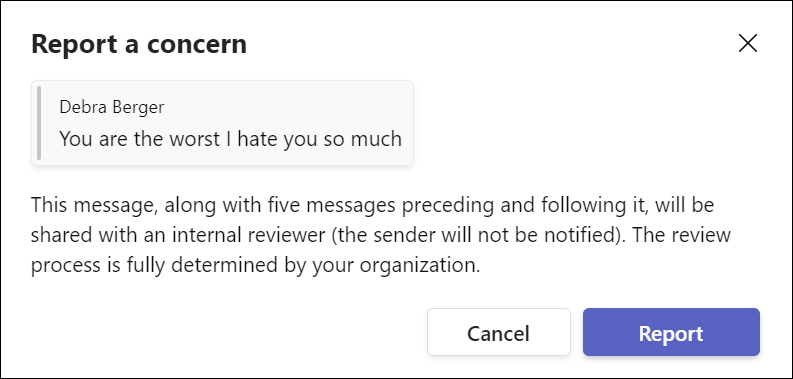

# Communication compliance with Microsoft Teams

Microsoft Purview Communication Compliance is an insider risk solution in Microsoft 365 that helps minimize communication risks by helping you detect, capture, and act on inappropriate messages in your organization.

For Microsoft Teams, communication compliance helps identify the [following types](/microsoft-365/compliance/communication-compliance-feature-reference) of inappropriate content in Teams channels, Private Teams channels, or in 1:1 and group chats:

- Offensive, profane, and harassing language
- Adult, racy, and gory images
- Sharing of sensitive information

For more information on communication compliance and how to configure policies for your organization, see [Learn about communication compliance](/microsoft-365/compliance/communication-compliance).

## How to use communication compliance in Microsoft Teams

Communication compliance and Microsoft Teams are tightly integrated and can help minimize communication risks in your organization. After you've configured your first communication compliance policies, you can actively manage inappropriate Microsoft Teams messages and content that is automatically flagged in alerts.

### Getting started

Getting started with communication compliance in Microsoft Teams begins with [planning](/microsoft-365/compliance/communication-compliance-plan) and creating pre-defined or custom policies to identify inappropriate user activities in Teams channels or in 1:1 and groups. Keep in mind that you'll need to [configure](/microsoft-365/compliance/communication-compliance-configure) some permissions and basic prerequisites as part of the configuration process.

Teams administrators can configure communication compliance policies at the following levels:

- **User level**: Policies at this level apply to an individual Teams user or may be applied to all Teams users in your organization. These policies cover messages that these users may send in 1:1 or group chats. Chat communications for the users are automatically monitored across all Microsoft Teams where the users are a member.
- **Teams level**: Policies at this level apply to a Microsoft Teams channel, including a Private channel. These policies cover messages sent in the Teams channel only.

### Report a concern in Microsoft Teams

The *Report a concern* option in Teams messages is enabled by default and can be controlled via Teams messaging policies in the [Teams admin center](/microsoftteams/manage-teams-in-modern-portal). This allows users in your organization to submit inappropriate messages for review by communication compliance reviewers for the policy. For more information about user-reported messages in communication compliance, see [Communication compliance policies](/microsoft-365/compliance/communication-compliance-policies#user-reported-messages-policy).

After submitting the message for review, the user receives a confirmation of the submittal in Microsoft Teams. Other participants in the chat do not see this notification.

Users in your organization automatically get the global policy unless you create and assign a custom policy. Edit the settings in the global policy or create and assign one or more custom policies to turn on or turn off this feature. For more information, see [Manage messaging policies in Teams](/microsoftteams/messaging-policies-in-teams).

### Act on inappropriate messages in Microsoft Teams

After you have configured your policies and have received communication compliance alerts for Microsoft Teams messages, it's time for compliance reviewers in your organization to act on these messages. This will also include user-reported messages if enabled for your organization. Reviewers can help safeguard your organization by reviewing communication compliance alerts and removing flagged messages from view in Microsoft Teams.

Removed messages and content are replaced with notifications for viewers explaining that the message or content has been removed and what policy is applicable to the removal. The sender of the removed message or content is also notified of the removal status and provided with original message content for context relating to its removal. The sender can also view the specific policy condition that applies to the message removal.

Example of policy tip seen by sender:

Example of policy notification seen by the sender:

Example of policy tip seen by recipient:

