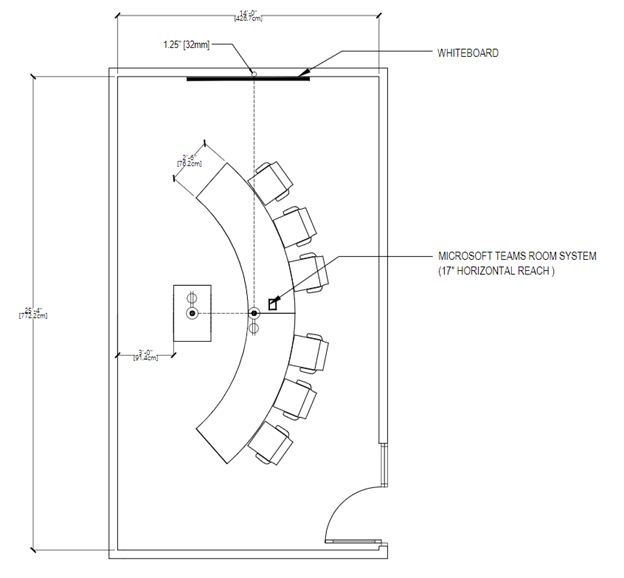
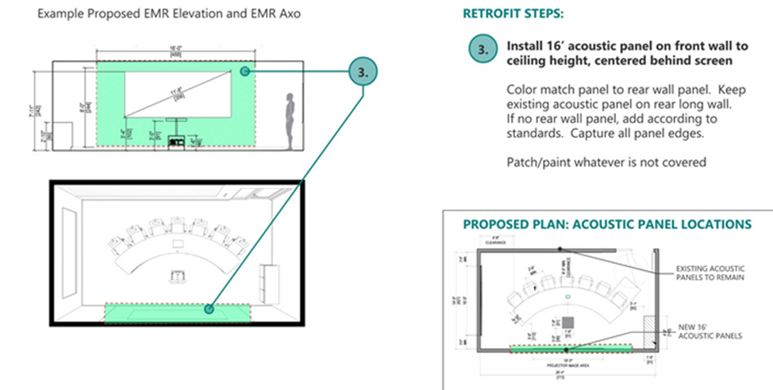
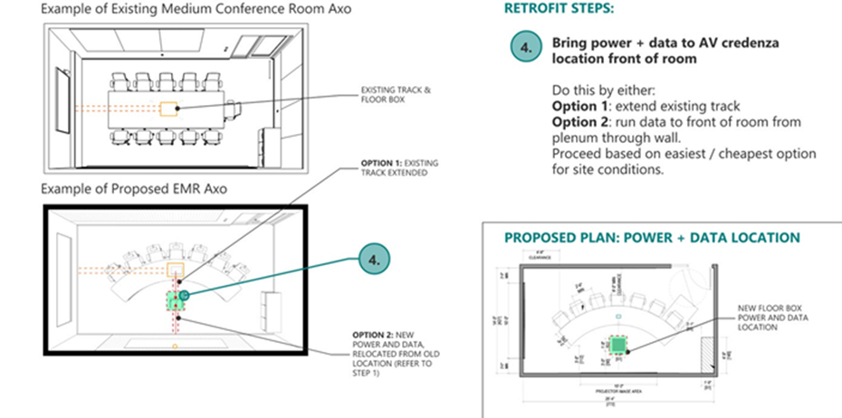
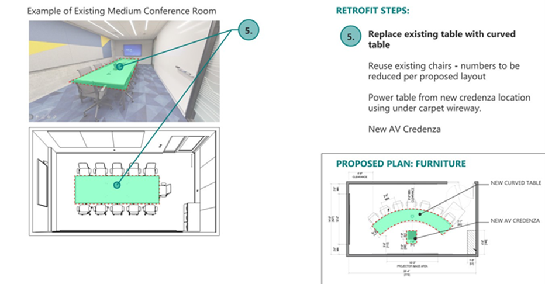
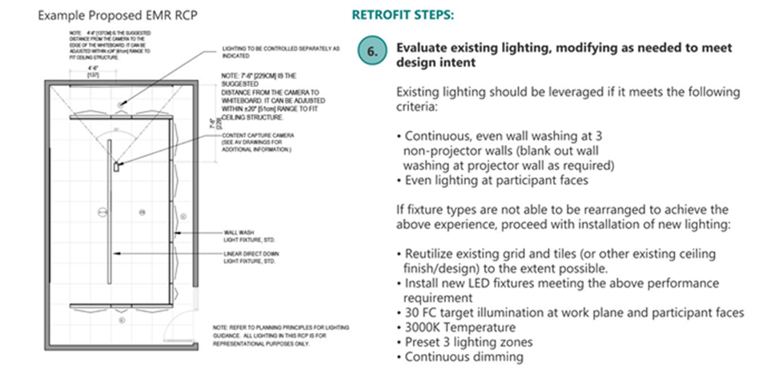

# Enhanced Meeting Room

This article is the first in a series that explores how Microsoft is transforming standard conference rooms into "Enhanced Meeting Rooms" that bring the best of the new Teams Front Row experience. This overview article contains room design and technology guidance, recommended products, retrofitting tips, and Microsoft Corporate Facilities reference specifications.

## Microsoft’s vision for the future of meeting rooms

The future of work will be fluid, dynamic, and powered by the cloud. Microsoft enables meeting experiences that allow people to be there, from anywhere, at any time. You can join these hybrid meetings seamlessly, and they're designed to bring people together. Meetings enhanced with Microsoft devices are inclusive; every voice is heard, and everyone is clearly represented.

Microsoft sees a future where meetings are immersive and spaces are designed around people, bringing everyone together around the same virtual table, even if they’re not in the room. Our dynamic meeting views keep everyone connected to the content and each other. Formal presentations are paired with collaborative chats, digital canvases unleash group creativity, and everyone can connect face to face wherever they are.

The vision for the future of meetings is grounded in a simple belief: meetings should offer so much more than just a one-time transaction. Meetings of the future will be designed for everyone, whether they’re in the room or across the world.

## What is an Enhanced Meeting Room?

In the Microsoft hybrid digital workplace, the next generation of room standards is informed by the needs of both remote and in-room participants. The objective of the Enhanced Meeting Rooms is to achieve effective, efficient, and inclusive meetings.

The concept for the Enhanced Meeting Room is driven by three key Experience Goals:

-   Immersive audio and video create a shared environment where everyone feels connected.

-   Whiteboarding technology allows remote and in-person attendees to collaborate in real time.

-   Participants are scaled for human connection; remote attendees are shown in at a close-to-life size, and responsive video technology allows them to see in-room colleagues when they speak, enabling a lifelike virtual experience.

An Enhanced Meeting Room is all those components and ideas put together with no single feature defining the experience. The individual features and concepts found in the Enhanced Meeting Rooms may be deployed on their own.

The following are some examples of specific feature deployments:

-   Taking advantage of the new Front Row meeting layout experience in all types of meeting spaces where there is a deployed Microsoft Teams Room system that supports it.

-   Implementing curved tables and front-facing layouts paired with traditional Microsoft Teams meeting room experiences to promote better human connection in the room while maintaining a continuity of experience across all meeting spaces.

## When should you deploy Enhanced Meeting Rooms?

Enhanced Meeting Rooms provide a specific type of Microsoft Teams meeting room experience that is meant to be a bridge between remote and in-person meeting participants in the hybrid digital workplace.

Enhanced Meeting Rooms should be deployed strategically within your organization to the spaces and locations where hybrid work is the most needed. The rooms are not meant to be a replacement for all the other meeting spaces inside of your organization, but rather to act as a supplement to existing meeting spaces that utilize Microsoft Teams.

### Understanding this space 

*Balancing hybrid flexibility with inclusion*

At Microsoft, flexible work guidelines prioritize giving employees agility when choosing where to work and when. This fundamental shift in policy has made Microsoft rethink the evolution of meeting spaces and technology.

Research has shown that all remote meetings during the pandemic have had many benefits—particularly around increased feelings of equity and inclusion. As companies think about returning in a hybrid setting, with remote and in-person collaboration happening simultaneously, Microsoft sought to create meeting spaces that better support the company’s flexible work policies while maintaining a level playing field for all participants through room design and technology.

Let’s start with a standard medium-sized conference room that would traditionally seat about 8-12 people.

From:

*Optimizing for in-person collaboration primarily with remote secondary audio-video (AV) as a supplement to the experience*

To:

*Optimizing for in-person and remote collaboration equally with AV as a driver for the experience*

### What is this space used for?

This space is dedicated to the most immersive hybrid Teams meeting experience for a small group of people.

Meeting participants can meet remotely and locally to work together seamlessly while both presenting and co-creating content.

### How is this space laid out?

The Enhanced Meeting Room layout is designed for maximum visibility and engagement with remote participants and content.

The layout features a curved table for in-person eye contact in addition to all chairs facing the displays with remote participants so everyone is able to follow along.

### How does the audio work? 

With Microsoft Teams Rooms-certified audio solutions, participants are able to hear and be heard at every point.

In the future, Enhanced Meeting Rooms will feature an audio system that utilizes a concept called spatial audio. People’s voices will appear to come from their faces as presented on the display, building on already great experience by making it feel like remote participants are in the room with local participants.

### How does the camera work?

To capture everyone in the space, an ultrawide-angle camera is positioned at the front of the room below the displays.

The ultrawide-angel camera features intelligent tracking of meeting participants so they can be represented individually in a large view instead of as faces within a large image of the entire room.

### How do the front-of-room displays work? 

This room features our new Front Row user interface (UI) displayed on a specialized short-throw high-resolution projector, creating an immersive front-of-room experience designed specifically for Teams meetings.

### What is Front Row?

To give people in the room a greater sense of connection to remote participants and support collaboration before, during, and after meetings, Microsoft is introducing a new content layout called Front Row. Visually, this new layout moves the video gallery to the bottom of the screen so in-room participants can see remote colleagues face to face across a horizontal plane—similar to if they were in the same room.

Meeting content is surrounded by contextual fluid components like the agenda, tasks, and notes, which can be updated in real time, helping participants stay engaged and productive. Additionally, the meeting chat is brought clearly into view, so that when in a room you can easily see and engage in the conversation in real time. This layout will be supported across both single and dual display configurations.

In an immersive room, this content is displayed via a wide-aspect-ratio screen to maximize the size of the meeting content and the remote participants’ faces.

### How do you co-create content?

Enhanced Meeting Rooms can take advantage of traditional whiteboarding with a content capture camera to join remote and in-person whiteboarding activities as well as leverage all-in-one touch devices like the Microsoft Surface Hub.

 

## Room design guidance

### Room layout 

#### Room size

25 ft x 14 ft

#### Room capacity 

This room optimized for inclusive meeting sizes—not too many, not too few (between 6-8 people).

#### Room table shapes

This room features a curved table for in-person eye contact as well as orientation to remote participants.

#### Room table height 

This room features a standard meeting room table with a height of 30 in or 76 cm.

#### Equipment mounting

Choosing an appropriate place for all devices is typically driven by the choice of Teams Rooms systems used within a certain meeting space.

For initial deployments within Microsoft facilities, the company has chosen to mount the Microsoft Teams Rooms system compute and touch console at the table. The camera soundbar and combination device is mounted between the front-of-room screen, along with the short-throw high-resolution projector on a central piece of specialized furniture from a partner, Heckler Design.

#### Touch console placement

The Microsoft Teams Rooms touch console should be mounted in the center of the table within easy reach of meeting participants without blocking usage of the table for personal devices or documents.

#### Local video presentation

Though many participants may choose to share content within this type of meeting room by joining the Teams meeting via a personal device to the Teams call, in-room local video presentation should also be made available at the table in an easily accessible manner.

## Infrastructure 

### Infrastructure power

At a minimum, electrical power connections should be provided at both the table (for end users) and at the equipment mounting location. If co-create devices are used in the space, electrical power connections may also be required at their location(s).

### Infrastructure data

Networking connections should be provided at both the table (for end users) and at the equipment mounting location (for the main network for the Teams Rooms system). If co-create devices are used in the space, network connections will also be required that connect to the main network for the Teams Rooms system.

### Acoustic wall treatments

At least two walls in a room of this type should be acoustically treated to prevent echo and ambient noise issues during meetings.

### Window treatments

Light from windows in a room of this type may negatively affect the lighting and introduce glare and shadows to both the camera image and the front-of-room display. Any space featuring windows should also feature window treatments that allow for external light to be blocked during meetings.

### Floor treatments

The floor in a room of this type should be carpeted or otherwise acoustically treated to prevent echo and ambient noise issues during meetings.

### Lighting 

Overhead lights should be provided to illuminate the space evenly, with meeting room participants not appearing to be washed out or sitting in a dark space. Efforts to minimize direct lighting on front-of-room displays, co-create devices, or other reflective surfaces within the space should be taken to avoid introducing glare.

## Technology guidance 

### Microsoft Teams Rooms system

Enhanced Meeting Rooms for Microsoft Teams require the use of Microsoft Windows-based Microsoft Teams Rooms systems.

### Cameras

#### Camera options

A room of this type requires the use of an intelligent, ultrawide-angle front-of-room camera that is appropriately rated for the width and depth of space.

#### Camera placement

The camera should be placed at the front of the room below the front-of-room display but above the top of the table to capture all the meeting room participants at as close to eye level as possible.

### Microphones

#### Microphone options

Front-of-room microphone arrays as well as tabletop and overhead microphones will work for this type of space.

#### Microphone placement

Microphone arrays need to be positioned to provide coverage for all meeting room participants within the certified range of the device.

### Speakers

#### Speaker options

Front-of-room speaker arrays as well as overhead speakers will work for this type of space.

Note: Spatial audio is not available and may require specific audio devices.

#### Speaker placement

Speakers need to be positioned to provide coverage for all meeting room participants within the certified range of the device or devices used.

### Front-of-room display

#### Display type

A room of this type requires the use of an ultrawide aspect ratio, high-resolution front-of-room display that is appropriately sized for the width and depth of space to ensure maximum visibility and clarity.

Example display types include:

-   Laser projectors

-   LED Video walls

-   Specialty LCD or OLED flat panel displays

#### Display functions

Enhanced meeting rooms, as with all other Microsoft Teams Rooms systems, require the use of displays that can accommodate the following features for proper operation:

-   Sleep and Quick Wake Up from sleep based on HDMI sync.

    -   For projectors, automatic warm-up and cooldown periods must be supported without required user intervention.

-   Displays must support the appropriate EDID and resolutions required by the Microsoft Teams Rooms design.

#### Display placement

An Enhanced Meeting Room requires that the display be placed in front of all the in-room meeting participants, directly opposite the table.

The horizontal center line of the display must be centered on the same center line as the table.

The vertical center line of the display must be no more than +/- 15 degrees offset from the eye line of a typical in-room meeting participant seated at the table.

#### Display count

An Enhanced Meeting Room requires that the display be either a single wide-aspect ratio display or a blended combination of displays that can achieve the effect of being a single display when seen by in-room meeting participants.

### Co-create options

#### Interactive display

Enhanced Meeting Rooms, like many other Teams Rooms, are able take advantage of an interactive collaboration device (such as a Microsoft Surface Hub) for co-creation and editing of content.

#### Traditional whiteboard 

Enhanced Meeting Rooms, like many other Teams Rooms, can leverage traditional whiteboards via a dedicated content camera. When installed, the content camera allows meeting participants to share thoughts and ideas from a traditionally analog white board to all other meeting participants.

## Recommended products for this space

### Microsoft Teams Room console and compute

-   A Windows-based Microsoft Teams Rooms system.

Within Microsoft, there’s been a lot of use of the Logitech TAP for the touch console paired with a Lenovo Compute device.

### Camera

-   An ultrawide camera with intelligent framing.

Within Microsoft, the Jabra Panacast 50 has seen a lot of use.

### Microphone

-   A certified microphone solution that will clearly capture all the in-room meeting participants.

Within Microsoft, the Jabra Panacast 50 has seen a lot of use.

### Speakers

-   A certified speaker solution that will provide clear and intelligible audio to all the in-room meeting participants.

Within Microsoft, the Jabra Panacast 50 has seen a lot of use.

### Displays

-   A short-throw, high-resolution laser projector with automatic wake on sync and cooldown during sleep function.

Within Microsoft, a model from Epson has been used.

### Co-create options

-   An analog whiteboard with a content camera.

Within Microsoft, the Logitech Scribe has been used.

## Retrofit an existing room 

Microsoft expects that Enhanced Meeting Rooms will be a highly desirable room layout for some of your meeting spaces.

### Select the right space

Where possible, choose a conference room that already meets the physical/design requirements listed above. This choice will minimize any intervention required.

In addition, look for the following considerations for ideal room selection:

-   A long wall without obstruction, including doors

-   Lighting that is easy to blank out at the long, unobstructed wall

-   Limited exterior windows (or adequate window treatments/blackout shades)

-   A floor core that is easily accessible toward the center of the room

If you are planning to add Enhanced Meeting Rooms to your existing spaces, see the following helpful reference that was followed for a Microsoft corporate meeting room:

#### Step 1 

#### Step 2

#### Step 3

#### Step 4

#### Step 5

#### Step 6

#### Step 7

## Microsoft Corporate Facilities reference specifications

The following reference specifications are used by the Microsoft Corporate Facilities Team when building an Enhanced Meeting Room. They’re shared here to act as a reference against which to compare your deployments.

### Design considerations 

> X Standard (Requirement)
>
> O Guideline (Recommended)

#### Adjacencies

-   Considered a “landmark” to aid in wayfinding and circulation.

<!-- -->

-   X Preference is for this to be an interior room, not a room with proximity to windows. In a controlled video environment, Microsoft suggests placing this room in a location where managing natural daylight is not required.

-   If at an exterior wall, black-out shades are to be provided.

### 

### Furniture/millwork

-   X Provide task chairs with a curved conference table.

    -   X ♿ Work and meeting surfaces must be dispersed in accordance with applicable codes.

-   X ♿ Provide grommets and access to power within 24" (61 cm) of the edge of the table.

-   X Provide millwork waste credenza with separate compartments for recycling, trash, and compost per local Recology options.

### Programming size

<table>
<colgroup>
<col style="width: 33%" />
<col style="width: 33%" />
<col style="width: 33%" />
</colgroup>
<thead>
<tr class="header">
<th><blockquote>

Area

</blockquote></th>
<th><blockquote>

Capacity

</blockquote></th>
<th><blockquote>

Dimensions

</blockquote></th>
</tr>
</thead>
<tbody>
<tr class="odd">
<td><blockquote>

X 350 ft² (32.5 m²) max”

</blockquote></td>
<td><blockquote>

X 7 in room

</blockquote></td>
<td><blockquote>

X 25’-4” x 14'-0" (7.7m x 4.3m)

</blockquote></td>
</tr>
<tr class="even">
<td></td>
<td><blockquote>

X Virtual participants per Microsoft Teams software capabilities

</blockquote></td>
<td></td>
</tr>
</tbody>
</table>

### Finishes and openings

<table style="width:100%;">
<colgroup>
<col style="width: 24%" />
<col style="width: 27%" />
<col style="width: 11%" />
<col style="width: 10%" />
<col style="width: 13%" />
<col style="width: 13%" />
</colgroup>
<thead>
<tr class="header">
<th><blockquote>

Openings

</blockquote></th>
<th><blockquote>

<strong>Walls</strong>

</blockquote></th>
<th><blockquote>

<strong>Ceiling</strong>

</blockquote></th>
<th><blockquote>

<strong>Floor</strong>

</blockquote></th>
<th><blockquote>

<strong>Base</strong>

</blockquote></th>
<th><blockquote>

<strong>Corner wall and protection</strong>

</blockquote></th>
</tr>
</thead>
<tbody>
<tr class="odd">
<td><blockquote>

X ♿ Provide a clear floor space on each side of all swing doors.

X Glass lite in door and glass relite or partition wall at entry.

O Glass film per Representative Drawings.

X Do not specify

writable film.

</blockquote></td>
<td><blockquote>

O Saturated paint colors are acceptable in moderation, as are neutrals

X Provide fabric wrapped panels to achieve NRC ratings per elevations.

<strong>Front wall</strong>

X Surface mounted projector screen (Dalite)

on acoustic panels.

X Provide level 4 finish (or regional equivalent) with eggshell PT-2 (lighter color) on the sides of the panels

</blockquote></td>
<td><blockquote>

O 2'-0"

(61 cm x 61 cm) acoustic ceiling tile *

</blockquote></td>
<td><blockquote>

O Carpet tile*

</blockquote></td>
<td><blockquote>

O 2.5"H

(6 cm) coved

resilient base

O Avoid specifying a light-colored base that will show scuffs and stains

</blockquote></td>
<td><blockquote>

X Stainless steel corer guards at high traffic corners (outside)

</blockquote></td>
</tr>
<tr class="even">
<td><blockquote>

X ♿ Where the meeting room is public facing, or where prescribed,

accessible meeting rooms should be equipped with an assisted door opener.

<strong>Windows</strong>

</blockquote></td>
<td><blockquote>

<strong>Rear wall</strong>

X Provide soft color finish (Medium gray with blue tint) for better camera recognition on the back wall.

X Level 4 finish (or regional equivalent) with eggshell PT-1 (Darker color).

</blockquote></td>
<td></td>
<td></td>
<td></td>
<td></td>
</tr>
<tr class="odd">
<td><blockquote>

X Provide room darkening window treatment when rooms contain exterior windows

</blockquote></td>
<td><blockquote>

<strong>Side walls</strong>

X Level 4 finish (or regional equivalent) with eggshell PT-1 (Darker color).

</blockquote></td>
<td></td>
<td></td>
<td></td>
<td></td>
</tr>
<tr class="even">
<td></td>
<td><blockquote>

X Writable surface with pen tray (per elevations). See Architectural Specifications.

</blockquote></td>
<td></td>
<td></td>
<td></td>
<td></td>
</tr>
<tr class="odd">
<td></td>
<td><blockquote>

X ♿ Provide appropriate clearance around writable walls.

</blockquote></td>
<td></td>
<td></td>
<td></td>
<td></td>
</tr>
<tr class="even">
<td></td>
<td><blockquote>

<strong>Note:</strong> Separate writable surfaces from fabric panels to avoid staining. Provide an extruded aluminum rail with a full-length wall mount bracket, and two end caps at the writable wall.

</blockquote></td>
<td></td>
<td></td>
<td></td>
<td></td>
</tr>
</tbody>
</table>

### Acoustics

<table>
<colgroup>
<col style="width: 12%" />
<col style="width: 14%" />
<col style="width: 16%" />
<col style="width: 12%" />
<col style="width: 11%" />
<col style="width: 15%" />
<col style="width: 17%" />
</colgroup>
<thead>
<tr class="header">
<th><blockquote>

Acoustically

Sensitive

</blockquote></th>
<th><blockquote>

% One Wall with NRC 0.80 Sound Absorptive Wall Treatment

</blockquote></th>
<th><blockquote>

Mid-Frequency Reverberation Time Goal (sec)

</blockquote></th>
<th><blockquote>

Room Average Noise Reduction Coefficient (NRCavg)

</blockquote></th>
<th><blockquote>

Acceptable Noise

Criteria (NC) Range

</blockquote></th>
<th><blockquote>

Acceptable dBA Range

</blockquote></th>
<th><blockquote>

Recommended Notes

</blockquote></th>
</tr>
</thead>
<tbody>
<tr class="odd">
<td><blockquote>

X Yes

</blockquote></td>
<td><blockquote>

X 50-100% of wall area on at least 2 walls.

X Entire ceiling with NRC 0.90

</blockquote></td>
<td><blockquote>

X 0.5

</blockquote></td>
<td><blockquote>

X 0.40

</blockquote></td>
<td><blockquote>

X 25-30

</blockquote></td>
<td><blockquote>

X 30-35

</blockquote></td>
<td><blockquote>

X Consider upgrading all walls to STC 50, with an STC 50 rated door.

</blockquote></td>
</tr>
</tbody>
</table>

### Audio-visual

<table>
<colgroup>
<col style="width: 13%" />
<col style="width: 15%" />
<col style="width: 12%" />
<col style="width: 15%" />
<col style="width: 12%" />
<col style="width: 13%" />
<col style="width: 16%" />
</colgroup>
<thead>
<tr class="header">
<th><blockquote>

Display

</blockquote></th>
<th><blockquote>

Camera

</blockquote></th>
<th><blockquote>

Speaker and Microphone

</blockquote></th>
<th><blockquote>

Occupancy Sensor

</blockquote></th>
<th><blockquote>

Conference Hallway Display (CHD)

</blockquote></th>
<th><blockquote>

Collaboration System

</blockquote></th>
<th><blockquote>

Recommended Notes

</blockquote></th>
</tr>
</thead>
<tbody>
<tr class="odd">
<td><blockquote>

X High-definition projector, minimum 16:9 aspect ratio

X One screen per room, install at front wall for projected image

</blockquote></td>
<td><blockquote>

X Install on the Projection wall per Representative Drawings

</blockquote></td>
<td><blockquote>

X Per AV Drawings

</blockquote></td>
<td><blockquote>

X Ceiling mounted People Counting sensor as required by DT Checklist

</blockquote></td>
<td><blockquote>

X Touch panel mounted on outside wall of room at +48"

A.F.F.

</blockquote></td>
<td><blockquote>

X Data sharing via Microsoft Teams Room System

</blockquote></td>
<td><blockquote>

X Provide cables at the tabletop to connect laptops and other sources to display

</blockquote></td>
</tr>
<tr class="even">
<td><blockquote>

X Provide minimum 1" conduit each for AV/data from table to projection wall See AV drawings for more information.

</blockquote></td>
<td></td>
<td></td>
<td></td>
<td></td>
<td></td>
<td></td>
</tr>
</tbody>
</table>

### Lighting

<table>
<colgroup>
<col style="width: 14%" />
<col style="width: 17%" />
<col style="width: 12%" />
<col style="width: 19%" />
<col style="width: 8%" />
<col style="width: 10%" />
<col style="width: 18%" />
</colgroup>
<thead>
<tr class="header">
<th><blockquote>

Dimming

</blockquote></th>
<th><blockquote>

Manual Lighting

Control

</blockquote></th>
<th><blockquote>

Automatic

Lighting Control

</blockquote></th>
<th><blockquote>

Color Temperature (Kelvin)

</blockquote></th>
<th><blockquote>

CRI

</blockquote></th>
<th><blockquote>

Lighting Density

</blockquote></th>
<th><blockquote>

Recommended Notes

</blockquote></th>
</tr>
</thead>
<tbody>
<tr class="odd">
<td><blockquote>

X Yes (Provide continuous dimming from 100% to 1% light output))

</blockquote></td>
<td><blockquote>

X Raise / Lower per lighting control zone

X Preset 3 button

(All on, All off, and Presentation mode)

</blockquote></td>
<td><blockquote>

X Vacancy

</blockquote></td>
<td><blockquote>

X 3000

</blockquote></td>
<td><blockquote>

X 90 &amp; above

</blockquote></td>
<td><blockquote>

X &lt;0.65 w/ft2

(7 w/m2)

</blockquote></td>
<td><blockquote>

X Provide dedicated supplemental lighting at writable surfaces

O For glare minimization, perimeter wall wash strategies should avoid doorways, glass walls, or glass clerestories

</blockquote></td>
</tr>
</tbody>
</table>

### Illumination

-   X FACES: 30 fc / 300 average horizontal at faces 48" (122 cm) A.F.F. with a.5:1 avg:min uniformity and 40 fc / 400 average vertical at faces 36" to 60" (91 cm to 152 cm) A.F.F. with 1.5:1 avg:min uniformity

-   X TABLES: 30 fc / 300 average horizontal at tables 30" (76 cm) A.F.F. with 1.5:1 avg:min uniformity

-   X WALLS (40% matte reflectance): 40 fc / 400 average vertical at 30" to 78" (76 cm to 198 cm) A.F.F. with 1.5: 1 avg:min uniformity X WALLS (50% matte reflectance): 30 fc / 300 average vertical at 30" to 78" (76 cm to 198 cm) A.F.F. with 1.5: 1 avg:min uniformity X WALLS (60% matte reflectance): 20 fc / 200 average vertical at 30" to 78" (76 cm to 198 cm) A.F.F. with 1.5: 1 avg:min uniformity X Front-screen projection display surface: 5 fc / 50 max vertical with 2:1 max:avg uniformity

-   X Video display or monitor surface: 20 fc / 200 max vertical with 2:1 max:avg uniformity

-   X Writable surface: Vertical illumination 150 lux (14 fc) on the front of writable surface during basic/general meeting functions.

\*\* Advanced camera and display technologies may have lower target illumination level requirements and should be followed instead to increase visual comfort of occupants subject to long durations of activity

### Electrical

<table style="width:100%;">
<colgroup>
<col style="width: 15%" />
<col style="width: 12%" />
<col style="width: 14%" />
<col style="width: 13%" />
<col style="width: 14%" />
<col style="width: 12%" />
<col style="width: 10%" />
<col style="width: 6%" />
</colgroup>
<thead>
<tr class="header">
<th><blockquote>

General Area Design Receptacle

Load(Watts/SF)

</blockquote></th>
<th><blockquote>

Specific Use Case Design Receptacle Load (Watts)

</blockquote></th>
<th><blockquote>

Specific Receptacle Requirements

</blockquote></th>
<th><blockquote>

Connected Electrical Equipment Load

</blockquote></th>
<th><blockquote>

Floor Connections

</blockquote></th>
<th><blockquote>

20A Circuit Quantity Provisions

</blockquote></th>
<th><blockquote>

Standby Power

</blockquote></th>
<th><blockquote>

UPS

Power

</blockquote></th>
</tr>
</thead>
<tbody>
<tr class="odd">
<td><blockquote>

X 2.5

</blockquote></td>
<td><blockquote>

O N/A

</blockquote></td>
<td><blockquote>

X Equivalent of double-duplex

receptacle at the center of the table.

X No back-to-back outlets within 24” (61 cm) of each other.

X Provide multiple combination USB/ receptacle to accessible power at counters and fixed seating, at least one per user in the space

</blockquote></td>
<td><blockquote>

X Provide 1 circuit for AV rack &amp; 1

circuit for all additional devices (table, projectors, cameras)

</blockquote></td>
<td><blockquote>

X Floor-box/

poke-thru as required per furniture layout.

</blockquote></td>
<td><blockquote>

X Maximum of (2) circuits per room

</blockquote></td>
<td><blockquote>

O None

</blockquote></td>
<td><blockquote>

O None

</blockquote></td>
</tr>
</tbody>
</table>

### Mechanical

<table>
<colgroup>
<col style="width: 13%" />
<col style="width: 14%" />
<col style="width: 14%" />
<col style="width: 12%" />
<col style="width: 5%" />
<col style="width: 10%" />
<col style="width: 14%" />
<col style="width: 12%" />
</colgroup>
<thead>
<tr class="header">
<th><blockquote>

Diversified

Misc. Mechanical Loads (Watts)

</blockquote></th>
<th><blockquote>

Heating Setpoint

</blockquote></th>
<th><blockquote>

Cooling Setpoint

</blockquote></th>
<th><blockquote>

Relative

Humidity

</blockquote></th>
<th><blockquote>

Air Class

</blockquote></th>
<th><blockquote>

Zoning

</blockquote></th>
<th><blockquote>

Operating Hours

</blockquote></th>
<th><blockquote>

Redundancy

</blockquote></th>
</tr>
</thead>
<tbody>
<tr class="odd">
<td><blockquote>

X 1,225

</blockquote></td>
<td><blockquote>

X 70°F (21°C)

</blockquote></td>
<td><blockquote>

X 75°F (24°C)

</blockquote></td>
<td><blockquote>

X No active humidity control.

Expected range

is 30-60%

</blockquote></td>
<td><blockquote>

X 1

</blockquote></td>
<td><blockquote>

X Dedicated

</blockquote></td>
<td><blockquote>

X Scheduled

</blockquote></td>
<td><blockquote>

X None

</blockquote></td>
</tr>
</tbody>
</table>

<table>
<colgroup>
<col style="width: 50%" />
<col style="width: 50%" />
</colgroup>
<thead>
<tr class="header">
<th><blockquote>

Connection Type

</blockquote></th>
<th><blockquote>

Notes

</blockquote></th>
</tr>
</thead>
<tbody>
<tr class="odd">
<td><blockquote>

Single Network - NTP Clock

</blockquote></td>
<td><blockquote>

(1) port. Visible by room occupants

</blockquote></td>
</tr>
<tr class="even">
<td><blockquote>

Single Conf. Hallway Display CHD

</blockquote></td>
<td><blockquote>

(1) port. Outside of room

</blockquote></td>
</tr>
<tr class="odd">
<td><blockquote>

Triple Corp

</blockquote></td>
<td><blockquote>

(3) ports. AV Router/Hub; UC Codec; IP Communications/Telephone

</blockquote></td>
</tr>
<tr class="even">
<td><blockquote>

Floor poke-thru and floor box

</blockquote></td>
<td><blockquote>

(3) to (8) ports. Locate in floor box/poke-thru(s)

</blockquote></td>
</tr>
</tbody>
</table>
