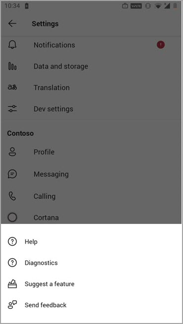

# Manage feedback policies in Microsoft Teams

Users in your organization can send feedback about Microsoft Teams to let us know how we're doing directly from within the Teams desktop, web clients, and mobile. We're continually improving the Teams experience and we use this feedback to make Teams better.

> [!NOTE]
> Feedback policies aren't available in GCC, GCC High, or DOD deployments.

**The **Give feedback** feature**

Users can send comments and suggestions about Teams to us by going to **Help** > **Give feedback** in Teams desktop and web.


Access feedback on mobile using **Settings** > **Help & feedback** > **Send feedback**.



 Data sent through **Give feedback** and  **Send feedback** is considered as "Support Data" under your Microsoft 365 or Office 365 agreement, including information that would otherwise be considered "Customer Data" or "Personal Data".


**Surveys**

Users can also rate their experience with Teams and send us details about the rating they give. This pop-up survey is displayed to users from time-to-time in Teams. When a user selects **Provide feedback** in the notification, the survey is displayed for them to complete.


## Set whether users can send feedback about Teams to Microsoft

As an admin, you can control whether users in your organization can send feedback about Teams to Microsoft and whether they receive the survey. By default, all users in your organization are automatically assigned the global (Org-wide default) policy, and the feedback feature and survey are enabled in the policy. The exception is Teams for Education, where the features are enabled for teachers and disabled for students.

You can edit the global policy or create and assign a custom policy. After you edit the global policy or assign a custom policy, it can take a few hours for changes to take effect.

Say, for example, you want to allow all users in your organization to send feedback and receive surveys except for new hires in training. In this scenario, you create a custom policy to turn off both features and assign it to new hires. All other users in your organization get the global policy with the features turned on.  

You manage feedback policies by using PowerShell. Use the [**New-CsTeamsFeedbackPolicy** cmdlet](/powershell/module/skype/new-csteamsfeedbackpolicy) to create a custom policy. Use the **Grant-CsTeamsFeedbackPolicy** cmdlet to assign it to one or more users or groups of users, such as a security group or distribution group. Use **Set-CsTeamsFeedbackPolicy** to set specific flags.

To turn off and turn on the features, set the following parameters:

 - **Give feedback**: Set the **userInitiatedMode** parameter to **enabled** to allow users who are assigned the policy to give feedback. Setting the parameter to **disabled** turns off the feature and users who are assigned the policy don't have the option to give feedback.

 - **Surveys**: Set the **receiveSurveysMode** parameter to **enabled** to allow users who are assigned the policy to receive the survey. To have users receive the survey and allow them to opt out, set the parameter to **enabledUserOverride**. In Teams, users can then go to **Settings** > **Privacy** and choose whether they want to participate in surveys. Setting the parameter to **disabled** turns off the feature and users who are assigned the policy won't receive the survey.

 - **Screenshots**: Use the **AllowScreenshotCollection** flag to add screenshot collection opt-in for users.
 - **Email**: Use the **AllowEmailCollection** flag to add an email field.
 - **Log collection**: Use the **AllowLogCollection** flag to add log collection opt-in for users. Log collection is currently enabled only on mobile. For more details on what data is shared via logs, [learn more](https://go.microsoft.com/fwlink/?linkid=2168178).
 - **Suggest a feature**: Set the **EnableFeatureSuggestions** parameter to True to allow users who are assigned the policy to suggest a feature. Setting the parameter to disabled turns off the feature and users who are assigned the policy don't have the option to give feedback. The default setting is taken from your Microsoft 365 optional connected experiences policy setting. To learn more about that setting, see [Overview of optional connected experiences in Office](https://learn.microsoft.com/deployoffice/privacy/optional-connected-experiences).

## Create a custom feedback policy

In this example, we create a feedback policy called New Hire Feedback Policy and we turn off the ability to give feedback through **Give feedback** and the survey.

```PowerShell
New-CsTeamsFeedbackPolicy -identity "New Hire Feedback Policy" -userInitiatedMode disabled -receiveSurveysMode disabled
```

## Assign a custom feedback policy to users

[!INCLUDE [assign-policy](includes/assign-policy.md)]

In this example, we assign a custom policy named New Hire Feedback Policy to a user named user1.

```PowerShell
Grant-CsTeamsFeedbackPolicy -Identity user1@contoso.com -PolicyName "New Hire Feedback Policy"
```

## Related topics

- [Teams PowerShell Overview](teams-powershell-overview.md)
- [Assign policies to your users in Teams](policy-assignment-overview.md)
