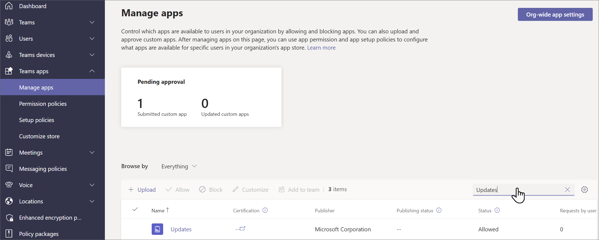
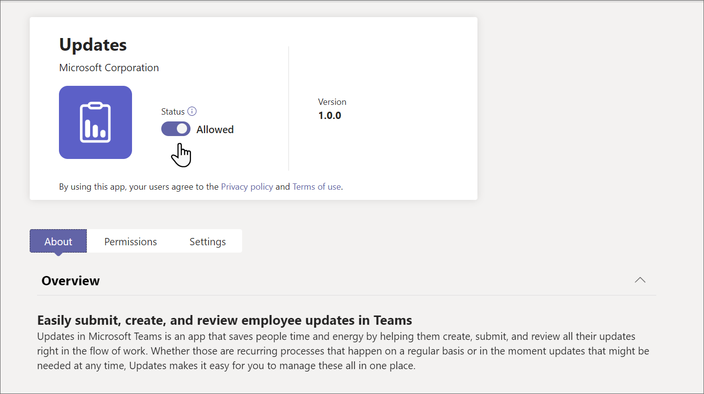

# Manage the Updates app for your organization in Microsoft Teams

## What is the Updates app

The Updates app in Teams provides a centralized place for members of your organization to create, review, and submit updates. By creating templates, you can use the Updates app to keep track of anything your organization needs.

In Teams, users can get Updates from the Teams app store. They'll see all of the updates they need to submit on the **Submit** page.
When a user is assigned an update, it will show up in their Teams activity feed. Users can also view all their current update requests and previous submissions in the Updates app. In addition, anyone can create templates and send out update requests.

Updates comes with both out-of-the-box templates for common business scenarios and the option to create your own template. Anyone can create a template for new types of updates. <!--link to end user content here-->

## Example scenario

Employees at a clothing store are responsible for opening and closing the store every day. Every morning, the shift leader fills out the Store opening update, which is an out-of-the-box template in the Updates app. In this update, they describe any issues with the previous night's closing, answer questions about the cleanliness of the store, and report any supplies that need replenished. Submitting an update lets them communicate their needs for the store and any problems quickly and efficiently. Daily updates also give the store associates an opportunity to highlight what's going well.

Meanwhile, a team of remote workers is updating the store's website. They're spread across time zones, so daily stand-up meetings aren't convenient. Instead, each of the team members submits daily Updates reports on their progress to the team leader.

## Required permissions and licenses

You need permission for the following items to deploy Updates:

- Permissions to create a Microsoft Dataverse database.

- An account on [powerautomate.microsoft.com](https://powerautomate.microsoft.com/)

- Administrator Role in your target environment.

- License for Power Automate, Office 365, or Dynamics 365.

- License for Microsoft Forms is required for users to set up new templates.

## Storage with Microsoft Dataverse

The Common Data Model (CDM) is the shared data language used by business and analytical applications in the Microsoft Dataverse. It consists of a set of standardized, extensible data schemas published by Microsoft and our partners that enables consistency of data and its meaning across applications and business processes. Learn more about the [Common Data Model](/common-data-model/).

Updates that are created from a template still store data in Microsoft Dataverse, such as their title, details, template ID, and more. Learn more about  [Data storage for Microsoft Forms](https://support.microsoft.com/office/data-storage-for-microsoft-forms-97a34e2e-98e1-4dc2-b6b4-7a8444cb1dc3#:~:text=Where%20data%20is%20stored%20for%20Microsoft%20Forms.%20Microsoft,European-based%20tenants%20is%20stored%20on%20servers%20in%20Europe).

>[!Note]
>If you delete the Form template on the Microsoft Forms site, it'll break your Updates template and users are unable to submit the update. Users get an error "CDB TableNotFound" when trying to open a template that has been deleted on Microsoft Forms.

## Updates Teams app permissions

The Updates Teams app lets you access the following features:

- Receive messages and data that you provide to it.

- Send you messages and notifications.

- Render personal apps and dialogs without a Teams-provided header.

- Access your profile information such as your name, email address, company name, and preferred language.

- Receive messages and data that team members provide to it in a channel.

- Send messages and notifications in a channel.

- Access your team's information:
  - team name
  - channel list
  - roster (team member's names and email addresses).

- Use the team's information to contact them.

## Disable the Updates app

The Updates app is available by default. You can disable the app in the Teams admin center.

  1. Sign in to the Teams admin center.

  2. Go to **Teams apps** > **Manage apps**.

  3. Search for the Updates app.

     

  4. Select **Updates**.

  5. Select the toggle to disable the app for your organization.

    

## Pin Updates to Teams

### Use the Tailored frontline app experience to pin Updates and other apps to Teams

The tailored frontline app experience in Teams pins the most relevant apps in Teams for users who have an [F license](https://www.microsoft.com/microsoft-365/enterprise/frontline#office-SKUChooser-0dbn8nt). Pinned apps include Updates, Approvals, Walkie Talkie, Tasks, and Shifts. By default, this feature is on, giving your frontline workers an out-of-the-box experience that’s tailored to their needs.

The apps are pinned to the app bar—the bar on the side of the Teams desktop client and at the bottom of the Teams mobile clients—where users can quickly and easily access them.

To learn more, including how the experience works with app policies that you set, see [Tailor Teams apps for your frontline workers](pin-teams-apps-based-on-license.md).

### Use an app setup policy to pin Updates to Teams

App setup policies let you customize Teams to pin apps that are most important for your users in your users.

To pin the Updates app for your users, you can edit the global (Org-wide default) policy or create and assign a custom app setup policy. To learn more, see [Manage app setup policies in Teams](teams-app-setup-policies.md).

## Retention policy

Updates created from the Updates app are stored in the default Microsoft Dataverse environment, which doesn’t support backups at this time. Learn more about how to [Back up and restore environments - Power Platform \| Microsoft Docs](/power-platform/admin/backup-restore-environments).

Data stored in Forms will not be deleted until the template creators clean it up from the **deleted forms** tab in the Microsoft Forms web app.

## Conditional Access policies

Currently, the Updates app in Teams does not support Conditional Access policies that are set for Microsoft Teams.

## Data limitations

Each user can create at most 400 Updates templates, and each template can collect a maximum of 50,000 requests based on the current capability in Microsoft Forms.

## Auditing (copied from Approvals - need additional input)

The Updates app logs audit events within the Microsoft 365 Security and Compliance Center. You can view the audit log.

1. Go to the [Microsoft Purview compliance portal](https://compliance.microsoft.com/)

2. Select the **Audit** section.

3. Search for activities under **Microsoft Teams approvals activities**.

You can search for the following activities:

- Create a new update template
- View the update templates
- Edit an update template
- Enable an update template
- Disable an update template
- Submit an update
- View the details of an update
- File attached to an update

For access to more auditing updates within Power Automate, enable and configure auditing in the default
environment for the primary update entities update, update template. Create, edit, enable, disable operations are auditable events for Update template records. Submit, view, file attached are auditable events for Update records. [Learn more about auditing](/power-platform/admin/audit-data-user-activity).

Auditing can be customized further in the [Microsoft 365 Security and Compliance Center](https://support.office.com/article/go-to-the-office-365-security-compliance-center-7e696a40-b86b-4a20-afcc-559218b7b1b8?ui=en-US&rs=en-US&ad=US).

1. To use the preconfigured reports, sign in to Microsoft 365 Security and Compliance.

2. Select **Search & investigation**.

3. Search the Audit log and select the **Dynamics 365 activities** tab.

Learn more about [Microsoft Dataverse and model-driven apps activity logging - Power Platform](/power-platform/admin/enable-use-comprehensive-auditing).

## Security

From the Teams Updates app, users have access to create new updates and view updates that they have sent and received. Users won't have access to Updates that are created by others unless they're a viewer of the request.

> [!Note]
> A user is given a viewer role of a request if they are part of the chat or channel where the update report was created. They won't have the ability to take action on the request if they weren't given that role when the report was created.
