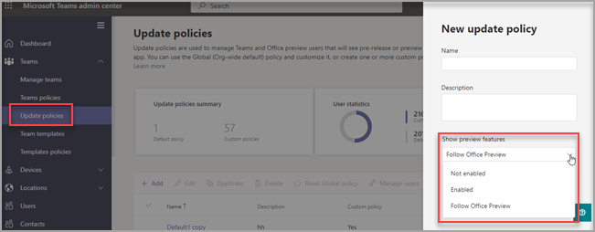

# Microsoft Teams Public Preview

> [!NOTE] 
> Features included in preview might not be complete and could undergo changes before becoming available in the public release. They’re provided for evaluation and exploration purposes only. The preview features aren't supported in Office 365 Government Community Cloud (GCC).

Public Preview for Microsoft Teams provides early access to unreleased features in Teams. Previews allow you to explore and test upcoming features. We also welcome feedback on any feature in public previews. Public preview is enabled per Team user, so you don’t need to worry about affecting your entire organization.

For a list of what's available in the Teams public preview, visit [Microsoft Teams Public Preview tech notes](https://techcommunity.microsoft.com/t5/microsoft-teams-public-preview/bd-p/MicrosoftTeamsPublicPreview), [Release Notes for Teams Admin Features](/OfficeUpdates/teams-admin), and [What's new in Teams](https://support.microsoft.com/office/what-s-new-in-microsoft-teams-d7092a6d-c896-424c-b362-a472d5f105de).

## Set the Update policy

Public preview is enabled on a per-user basis, and the option to turn on public preview is controlled in an admin policy. Update policies are used to manage Teams and Office preview users who will see pre-release or preview features in the Teams app. You can use the Global (Org-wide default) policy and customize it, or create one or more custom policies for your users. The policy needs to be assigned to specific users because it doesn’t over-write the global policy.

1. Sign in to the admin center.

2. Select **Teams** > **Update policies**, and then select the **Update policies** option.

1. Select **Add** to create a new policy or select an existing policy to open **Update policy**.

2. Name the update policy, add a description, and select the setting for **Show preview features**.

   -   **Follow Office Preview** (default): This new default option will automatically enable Teams Public Preview features for any user enrolled in Office Current Channel (Preview). There are no more actions required by the end user.
   -   **Enabled**: This option enables Teams Public Preview regardless of whether a user is enrolled in Office Current Channel (Preview). The end user must also opt in to Teams public preview in their Teams app.

   > [!NOTE]  
   > For existing users in Teams Public Preview who are NOT in the **Current Channel (Preview)**, IT admins need to switch from default, **Follow Office Preview** to **Enabled**.
 
   - **Not enabled**: Teams Public Preview features will not be available to end users.

      

You can also set the policy using the PowerShell `Set-CsTeamsUpdateManagementPolicy` cmdlet with the `-AllowPublicPreview` parameter.

> [!NOTE]   
> AllowPreview parameter will be deprecated soon.

## Enable public preview

To enable public preview on a desktop or web client, you need to complete the following tasks:

1. Select the three dots to the left of your profile to display the Teams menu.
2. Select **About** > **Public preview**.
3. Select **Switch to Public preview**.

> [!NOTE]  
> This option is only available when **Show preview features** is set to **Enabled**.

## Teams now follows Office Preview users

The new global policy default of **Follow Office Preview** will allow users to automatically be in the Public Preview channel of Teams if they are in Current Channel (Preview) for the Office 365 Client on Windows.

Microsoft Office will continue to receive updates from Current Channel (Preview) and Teams client will receive updates via Public Preview channel. This policy will NOT switch Office channels based on Teams channels. 

**How to retain your existing Teams preview users who are NOT using Office Current Channel (Preview)?**

For existing users who you have allowed to opt-in or opt-out of Teams Public Preview and want to maintain that setting in its current form, you will need to switch from the new default, **Follow Office Preview** to **Enabled** (Refer to [Set the Update policy](#set-the-update-policy))

**How to opt-out of this setting?**

You can disable the setting from Teams Admin Center from **Follow Office Preview** to **Not Enabled** (Refer to [Set the Update policy](#set-the-update-policy))

## Known Issues

Office Current Channel (Preview) users may exit Teams Public Preview through Teams client About menu while their update policy is set to **Follow Office Preview**. This functionality is not intended and will be removed in the future. Teams client may automatically set itself back to Public Preview when the device is idle the next time if user is in Current Channel (Preview) for Office.

## Related topics

[Public developer preview](/microsoftteams/platform/resources/dev-preview/developer-preview-intro)
