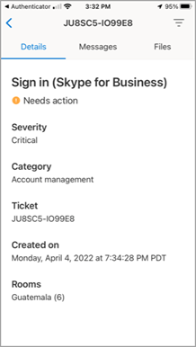
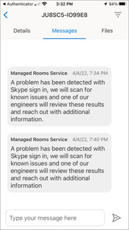
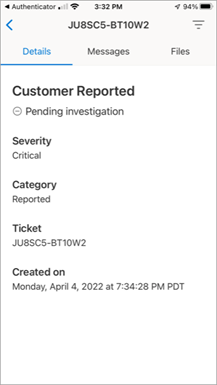

# Teams Rooms mobile client application features

There may be times when you need to manage Teams Rooms Managed Services (MTMS) from your mobile device. The mobile app has many capabilities you can manage from your mobile or tablet device.
## Before you begin

You must be an administrator in a Microsoft 365 organization to use the Teams Rooms mobile app.
Download the Teams Rooms mobile app from either the [Apple App Store](https://apps.apple.com/app/apple-store/id761397963?pt=80423&ct=docsaboutadminapp&mt=8) or the [Google Play Store](https://play.google.com/store/search?q=Microsoft%20Teams%20Rooms&c=apps).

The mobile client offers both creating tickets and managing incidents capabilities within your organization.

## Next steps

**To get the MTMS mobile app**

1. Search for Teams Rooms Managed Services in the app store for your device and install it.
2. Sign in with your global admin email address, and view the dashboard to see service health, monitor user licenses, and see messages and service requests.

**To use the Teams Rooms mobile app**

1. Download the app from either the [Apple App Store]() or the [Google Play Store]().
1. Ensure that you have a valid Microsoft 365 subscription.
1. Use your work credentials that you use to access the Teams Rooms desktop app.

## Managing incidents

Here are some of the capabilities you have on the mobile app for managing incidents.

- Receive push notifications for new incidents.
- Tap the notification to open and view incident details immediately.
- List all active and resolved incidents including read and unread status on messages.
- View the basic incident details with ticket information, including messages.
- View ticket attachments and files.
- Sign out from a user panel (notifications/messages are disabled if signed out).

The Incidents page shows the types of open incidents.

### Report an incident

### View an incident by category

### Managing tickets
Here are some of the capabilities you have on the mobile app for managing tickets.

- Acknowledge incident (mark as read).
- Read, post, and reply to messages on a ticket.
- Toggle to Dark Mode.
- Add an attachment (take and upload pictures).
- Create a ticket to report on an incident.
- Managed security and communication with experts using Microsoft Defender

The app displays ticket details, messages, and files under separate tabs.

<!--

### Sign out

-->

## Troubleshooting

You can try some common mobile app troubleshooting steps:
- Close and reopen the app.
- Uninstall and reinstall the app.Ensure that you are on the latest version of the app.
- If you have Microsoft Authenticator or Company portal app installed on your device, try reinstalling it or updating to the latest version. If that doesn't work, you can email us at feedback365@microsoft.com to let us know.
