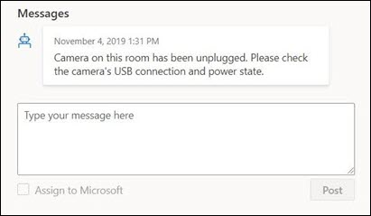
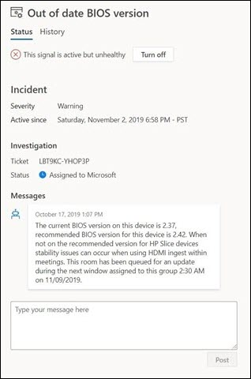
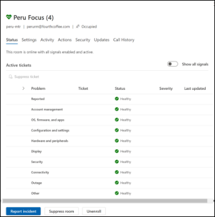
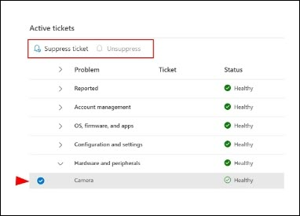
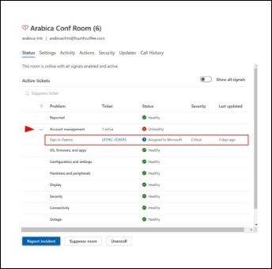
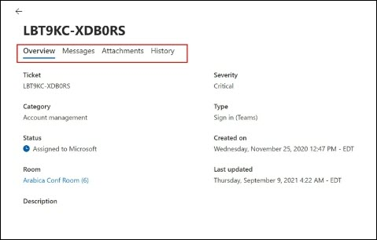
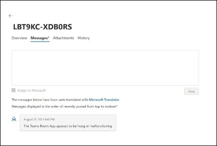
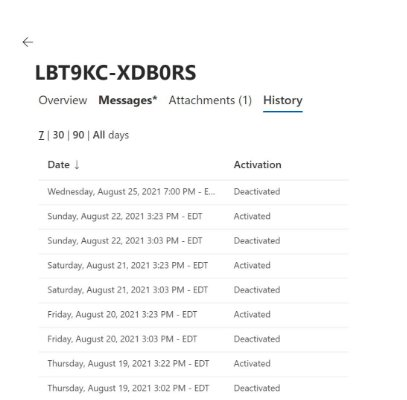

---
title: Microsoft Teams Rooms Portal
author: donnah007
ms.author: v-donnahill
manager: serdars
ms.reviewer: dstrome 
ms.topic: article
ms.tgt.pltfrm: cloud
ms.service: msteams
audience: Admin
ms.collection: 
  - M365-collaboration
  - m365initiative-meetings
appliesto: 
  - Microsoft Teams
ms.localizationpriority: medium
search.appverid: MET150
description: Provide a view of the health of your meeting rooms.
f1keywords: 
---

# Microsoft Managed Meeting Rooms Portal 

## Overview 
The Managed Meeting Rooms Portal (“Rooms Portal”) provides a view of the health of your meeting rooms. A customer view of this portal is for your visibility and feedback, and to facilitate your existing monitoring tools/practices. 

The scope of the monitoring is

- View of incidents 
  - Top issues affecting your rooms 
  - Actions required to restore rooms to healthy status 
  - Issues that are under investigation by Microsoft 
- View of Microsoft Teams Room devices
  - Snapshot of status at Microsoft Teams Rooms (MTR) device level 
  - Basic history and details for every device 

**View of Microsoft Teams Room devices** 

- Snapshot of status at Microsoft Teams Rooms (MTR) device level 
- Basic history and details for every device 

> [!Important]
> Review [**Assign users to the Managed Service Administrator role**](enrolling-mtrp-managed-service.md#assign-users-to-the-managed-service-administrator-role) and make sure that access to the portal is limited based on your business needs. 

## Terminology 
Here are frequently used terms in the portal. 

|Term |Meaning |
| :- | :- |
|**Monitoring Software** |Monitoring agent that is deployed in each of the Microsoft Teams Room devices. |
|**App** |Microsoft Teams Room system app (regardless of whether it uses Skype for Business or Microsoft Teams as the collaboration service. |
|**Room/Device** |The certified Microsoft Teams Room system device. |
|**Unmonitored** | Microsoft monitoring software deployed as part of managed services is not able to connect to the cloud services. We are not receiving telemetry about the device. |
|
**Healthy /** 

**Unhealthy** 
|Abnormalities in device / peripheral. |
|**Suppressed** |If a device is known to be in maintenance, and its alerts should be ignored, the device can be suppressed deliberately. |
|**Onboarding** |The state of a room device while it is getting setup added, but is not ready as a regularly supported room. |
|**Incident** |An issue affecting meeting experiences of end users that need action. |
|**Misconfigured** |Configuration detected is not  correct / commonly used. |
|**Support Ticket** |Internal Microsoft tracking identifier that tracks all communications / actions regarding an incident. |

## Incidents view 
This view is an overview of the Incidents tab in your Managed Rooms Portal. This page is the default home page of the portal. 

### Top-level summary 
The top-level summary shows at a glance the issues affecting your rooms, what you need to do, and what Microsoft is doing about them: 

 

|# |Explanation |
| :- | :- |
|1 |Types of incidents affecting your rooms |
|2 |**NEED ACTION**: Items that require your intervention to resolve. |
|3 |**ASSIGNED TO MICROSOFT**: Items currently investigated by Microsoft personnel. |
|4 |**PENDING INVESTIGATION**: Items in the queue to be investigated by Microsoft personnel. |

Incidents are expected to be in one of three states: 

- **Need Action**: Assigned to you for action 
- **Assigned to Microsoft**: Assigned to Microsoft for the next action 
- **Pending Investigation**: Under investigation for next steps 

### Reviewing incidents 
The following image lists all the incidents that are currently active in your rooms. The ones that are assigned to you *are on the top* – these are what you need to look at for next steps. In addition, the ones assigned to Microsoft or pending investigation have details that you can use to intervene. 

 

Clicking  any of items that have status “**Needs action**” shows additional details about the incident. 

 
## Types of Incidents 
Incidents are classified into two broad severity buckets: 

- **Important**: Incidents that are are likely causing problems in meetings and should be prioritized. 
- **Warning** – Incidents that are notifications to plan maintenance actions. If these are not taken care of, then over time the rooms are more likely to hit an issue. Warnings are intended to give you time to plan and orchestrate support. 

A warning might transition to “**Important**” if not attended to for a while. 

## Health status of device and incidents 
Incidents that are classified as **“Important”** in severity will affect the health status of a device. If there is at least one incident of **Severity = “Important”** associated with a device, it is classified as ***unhealthy*** device. 

Incidents classified as **“Warning”** severity do not affect the health status reported on a device. However, if a device has warning level incidents associated with it, then it would be shown with the health status of the device as follows. 

 

Following are some of the types of incidents that you might see and the explanations for each type. For each type, the action associated with the incident will be more specific depending on the issue. 

**Table 1: Incidents with “Important” severity**

|Type |Explanation |
| :- | :- |
|**Display** |The display connected to the device does not appear to be healthy.|
|**Conference microphone, Conference speaker** |The audio devices (microphone / speaker) seem to be misconfigured. |
|**Camera** |The camera connected to the device does not appear to be healthy. |
|**HDMI Ingest** |HDMI Ingest is not healthy. |
|**Sign-In** (Exchange) |Microsoft Teams Room app accesses calendar information from Exchange and any issue with sign-in success will be reported with a sign-in incident. |
|**Sign-In** (Teams) |Microsoft Teams Room app signs into the device and failure to sign-in will be reported with this incident (if the customer is using Teams). |
|**Sign-In** (Skype for Business) |Microsoft Teams Room app signs into the device, and failure to sign in will be reported with this incident (if the customer is using Skype for Business) |
|**Proximity Sensor** |Microsoft Teams Room app invites attendees to join a meeting if they are in proximity. Failures in this feature will be reported under this incident. |

**Table 2: Incidents with “Warning” severity**
|Type |Explanation |
| :- | :- |
|**App version** |The version of the Microsoft Teams Room App running on the device is not current. Stale versions are known causes to problems experienced by users. |
|**OS version** |The version of Windows operating system running in the meeting room is no longer recommended. |
|**Network** |This will be removed as a type of warning in the near term due to additional work required after evaluation. |

## Responding to Incidents 
Incidents fall into three categories: Needs Action, Pending Investigation, or Assigned to Microsoft.

### “Needs Action” Incidents 

Incidents that have status set to **“Needs Action”** are assigned to you to take a corrective action. 

Each such incident will have an action field with a recommended action from Microsoft as follows: 

- If you have taken the action, you can respond to the incident with your notes in the Respond box, then choose “Assign to Microsoft” before posting. 
- It is also possible that the notification is incorrect based on your review. In that case, please provide that feedback and assign back to Microsoft. 
- Finally, if you want to add a comment to provide additional context for your own team or for Microsoft team, post the message without turning on “Assign to Microsoft“. 

>[!NOTE]
>Your corrective action may address the issue, and that Managed Rooms monitoring clears that incident from your list. In the above situation, you might not get a chance to resolve the issue and assign it back to Microsoft. This issue will be addressed in a future release. 

### “Pending Investigation” incidents 
For the incidents under investigation, the description field holds information about the incident, typical causes, and resolutions that may be useful to resolve certain issues so that you can act without delay. 

### “Assigned to Microsoft” incidents 
For the incidents assigned to Microsoft, the “Action” field will contain brief details about corrective steps either planned or progressed. These steps might need collaboration with your team and extended collaboration will be done through email/calls as needed. Once these issues are resolved, they will disappear from the portal and in future, there will be history to track such incidents and their resolution. 

 
## Rooms View 
Each device is a proxy for a room and its connected peripherals. A healthy device represents a healthy room and an unhealthy device represents a room likely causing problems during meetings. In addition to the Incidents view, Managed Rooms Portal also provides a room health overview, and helps you to troubleshoot device details, and to understand repeated failures with incident history. 

 

**Healthy, Unhealthy, Disconnected** 
The top panel on the Rooms view provides a quick snapshot of how many of your devices are in a good state(“Healthy”), how many are affected by issues(“Unhealthy”), how many are not providing telemetry (“Disconnected”), and how many devices are suppressed from alerting (as an override). Rooms are monitored for health using an evolving criteria and heuristics. The goal is to reflect the reality of the user experience in the room as accurately as possible and make it actionable. 

**Healthy / Unhealthy rooms**: 

Devices/peripherals which do not have any incidents of severity “Important” are meeting current criteria for health are marked as healthy. However, it does not imply that there is a room outage for every unhealthy device in the portal. The description and action part of the incident contains more specific details about the issue and potential impact on user experience. 

<!--**Limitations of Monitoring Heuristics**: 

It is possible that telemetry is not able to detect all possible issues currently. Rooms that are marked healthy might still experience a problem (false negatives). It is also possible that rooms that are marked unhealthy are not causing actual problems. In both cases, such issues are great candidates for feedback to Microsoft during this pilot. -->

**Disconnected device:** 

The Microsoft monitoring agent deployed as part of Managed Rooms pilot is disconnected from Managed Room cloud services. We are not receiving telemetry about the room and do not have latest health status. This may happen due to network issues, firewall policy changes or if there are changes made to the device image. 

## Room Detail: Status and Changes
**Room Details: Status**
The device *Status* tab provides a consolidated view of status of a device, all the issues active for the device, the actions that are needed to resolve them, or that are ongoing. The Status tab also contains the breakdown of different components of health for the device under *Incidents tab*. If a device is disconnected, Status details will not be available. 

**Show all signals:**
To view all signals contained within a signal category, enable the Show all signals toggle button. Expansion arrows will appear next to category headings which can be clicked on to expand the accordion view.

**Suppress/Unsuppress Ticket** 
When a room is enrolled, you are indicating that you want to receive notifications for changes in room telemetry. There are occasions when a particular device or peripheral is in a known state where you do not want tickets or notifications generated. Using the Suppress ticket functionality, will silence any notification about that particular signal. When you are ready for the service to monitor and notify you about that signal, simply unsuppress the individual signal.

**Active Ticket Category Expansion** 
Under each ticket category, any active or latest resolved ticket will be displayed along with the severity and when the ticket was last updated. By clicking on the expansion arrow, all tickets will appear with an active link to the ticket information.

Active Ticket Category Expansion: 
Under each ticket category, any active or latest resolved ticket will be displayed along with the severity and when the ticket was last updated. By clicking on the expansion arrow, all tickets will appear with an active link to the ticket information.

## Active Ticket: Overview
Each incident that is created identifies the issue that has been detected and the corrective action that needs to be taken to restore the room to a healthy state. The ticket generated will convey incident overview with any messages generated by the managed services AI as well as the Microsoft service engineering team investigating the issue. All attachments that have been collected for incident troubleshooting will be listed. The history tab provides the dates that issues have been identified.

 

Active Ticket: Messages 
The messages UI is the primary communication tool to interact with Microsoft service engineers working to remediate the issue identified. It is important to acknowledge communications from Microsoft to ensure that we are providing you with the best possible service. If you have taken the actions recommended, respond to this incident with your notes in the Respond box and assign back to Microsoft by clicking on “Assign to Microsoft” before posting.
It is also possible that the notification is incorrect based on your review. In that case, please provide that feedback and assign back to Microsoft. 
 Finally, if you want to add a comment to provide additional context for your own team or for Microsoft team, simply post the message without turning on “Assign to Microsoft

 

 
Active Ticket: Attachments
There are occasions where Microsoft service engineers need additional information to augment their investigation of the issue. The attachment tab provides you with the ability to upload pictures, videos or logs that are requested.

 

 
Active Ticket: History
Each room signal has only one ticket number that is assigned to it on purpose. A room device or peripheral persists in a room and may have issues over time. By maintaining this information under a specific unique ticket id, all historic information is maintained and can be analyzed for patterns of behavior. The History UI provides a view of all tickets actions created and resolved for this signal.

 
 

FAQ 
How does dynamic tickets affect me and the operations of my rooms?  
Customers will see the creation of smarter tickets and remediations that expand beyond just a binary signal ticket. For example, there can be as many as three displays in a Meeting Room (Display 1, Display 2 & the MTR touch panel display). However, there is only 1 (one) display signal that is either Healthy or Unhealthy. With the new dynamic tickets, we can now generate tickets unique to each display signal. 
