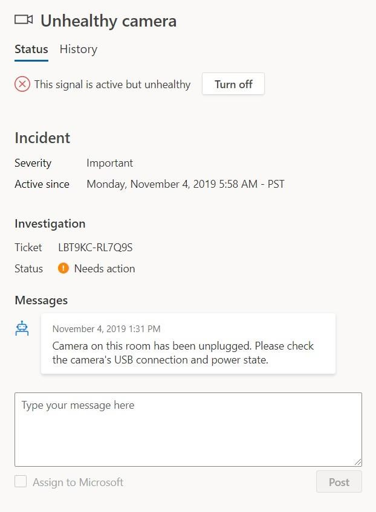
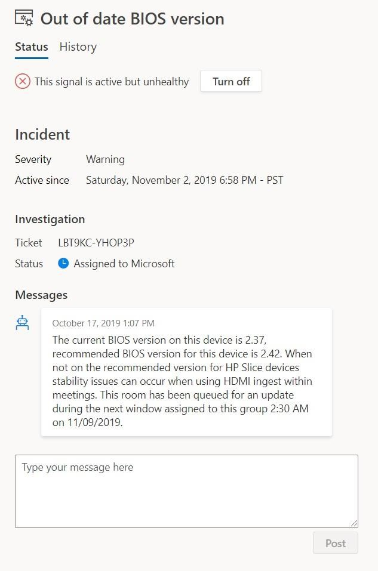
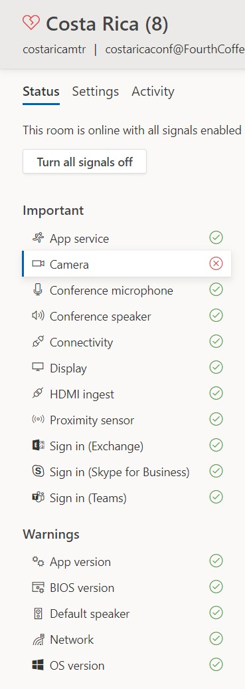
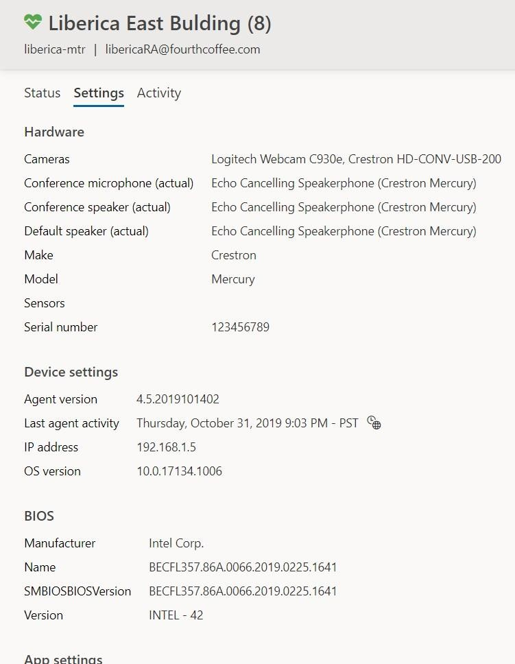
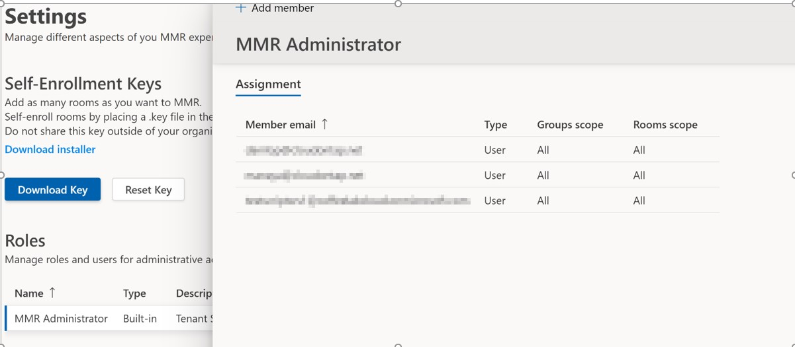
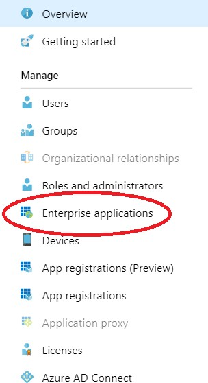
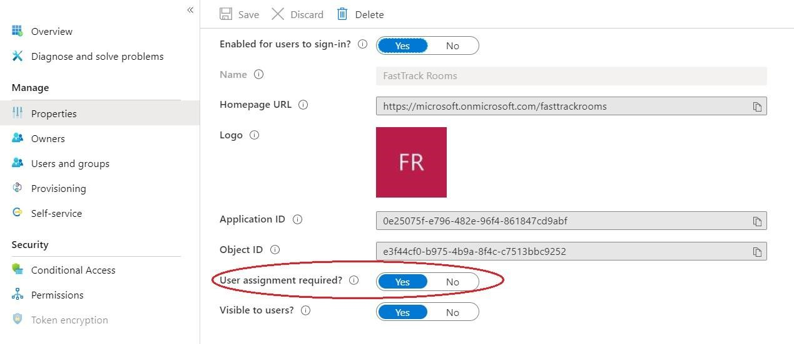
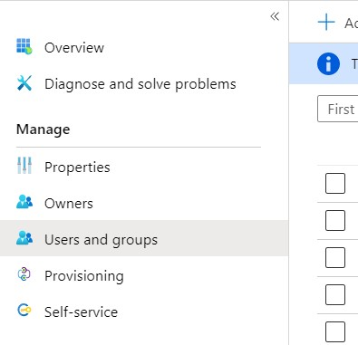

---
title: Microsoft Teams Rooms Portal
ms.author: v-donnahill
manager: serdars
ms.reviewer: dstrome 
ms.topic: article
ms.tgt.pltfrm: cloud
ms.service: msteams
audience: Admin
ms.collection: 
  - M365-collaboration
  - m365initiative-meetings
appliesto: 
  - Microsoft Teams
ms.localizationpriority: medium
search.appverid: MET150
description: Provide a view of the health of your meeting rooms.
f1keywords: 
---

# Microsoft Managed Meeting Rooms Portal 

## Overview 
The Managed Meeting Rooms Portal (“Rooms Portal”) is meant to provide a view of the health of your meeting rooms. This portal is used for providing support to you as part of Meeting Rooms Trial program. We are releasing a customer view of this portal for your visibility and feedback. This is meant to facilitate your existing monitoring tools/practices. 

The scope of the current release is: 

**View of Incidents** 

- Top issues affecting your rooms 
- Actions you need to take to restore rooms to healthy status 
- Issues that are being acted on/being investigated by Microsoft 

**View of Microsoft Teams Room Devices** 

- Snapshot of status at MTR device level 
- Basic history, details for every device 

This document provides an overview of the Managed Meeting Rooms Portal (Private Preview) functionality for the current release. 

Important Reminder: 

- Please review this section and make sure that access to the portal is limited based on your business needs. 

## Terminology 
This is quick review of the frequently used terms in the portal. We would love to have feedback if any of these terms do not make sense. 

|Term |Meaning |
| :- | :- |
|**Monitoring Software** |Refers to the monitoring agent that is deployed in each of the Microsoft Teams Room devices. |
|**App** |Refers to the Microsoft Teams Room system app (regardless of whether it uses Skype for Business or Microsoft Teams as the collaboration service. |
|**Room/Device** |Refers to the certified Microsoft Teams Room system device. |
|**Disconnected** |
The Microsoft monitoring software deployed as part of Managed Rooms pilot is disconnected from Managed Room cloud services. 

We are not receiving telemetry about the device. 
|
|
**Healthy /** 

**Unhealthy** 
|If we detect abnormalities in device / peripheral, it will be shown as unhealthy. |
|**Incident** |This conveys an issue affecting meeting experiences of your end users that needs action. |
|**Misconfigured** |Conveys that the configuration detected does not seem correct / commonly used. |
|**Support Ticket** |An internal Microsoft tracking identifier with which we track all communications / actions regarding an incident. |

# Incidents View 
This is an overview of the Incidents tab in your Managed Rooms Portal. This is the default home page of the portal.  
### Top-Level Summary 
 

The top-level summary shows at a glance the issues affecting your rooms and what you need to do, what Microsoft is doing about them: 

|# |Explanation |
| :- | :- |
|1 |Types of incidents affecting your rooms |
|2 |**NEED ACTION**: These are items we need your intervention to resolve. |
|3 |**ASSIGNED TO MICROSOFT**: These are items being investigated by Microsoft personnel. |
|4 |These are items in queue to be investigated by Microsoft personnel. |

Incidents are expected to be in one of these 3 states: 

- **Need Action**: Assigned to you to act on 
- **Assigned to Microsoft**: Assigned to Microsoft for the next action 
- **Pending Investigation**: Under investigation for next steps 

#### Reviewing Incidents 
The table below lists all the incidents that are currently active in your rooms. The ones that are assigned to you *are on the top* – these are what you need to look at for next steps. In addition, the ones assigned to Microsoft or pending investigation have details that you can use to intervene. 

 

If you click on any of items that have status “**Needs action**”, you will see additional details about the incident. 

 
## Types of Incidents 
We have classified incidents into two broad severity buckets: 

- **Important** – these are likely causing problems in meetings and should be taken care of on priority. 
- **Warning** – these are notifications to plan maintenance actions. If these are not taken care of, then over time the rooms are more likely to hit an issue. Warnings are intended to give you time to plan and orchestrate support. 

A warning might transition to “**Important**” if not attended to for a while. 

## Health Status of Device & Incidents 
Incidents which are classified as **“Important”** in severity will affect the health status of a device. If there is at least one incident of **Severity = “Important”** associated with a device, it will be classified as ***unhealthy*** device. 

Incidents classified as **“warning”** severity do not affect the health status reported on a device. However, if a device has warning level incidents associated with it, then it would be shown with the health status of the device as follows. 

 

Following are some of the types of incidents that you might see and the explanations for each type. For each type, the action associated with the incident will be more specific depending on the issue. 

### Incidents with Severity = “Important” 

|Type |Explanation |
| :- | :- |
|**Display** |The display connected to the device does not appear to be healthy.|
|**Conference microphone, Conference speaker** |The audio devices (microphone / speaker) seem to be misconfigured. |
|**Camera** |The camera connected to the device does not appear to be healthy. |
|**HDMI Ingest** |HDMI Ingest is not healthy. |
|**Sign-In** (Exchange) |Microsoft Teams Room app accesses calendar information from Exchange and any issue with sign-in success will be reported with a sign-in incident. |
|**Sign-In** (Teams) |Microsoft Teams Room app signs into the device and failure to sign-in will be reported with this incident (if the customer is using Teams). |
|**Sign-In** (Skype for Business) |Microsoft Teams Room app signs into the device and failure to sign-in will be reported with this incident (if the customer is |
| |using Skype for Business) |
|**Proximity Sensor** |Microsoft Teams Room app invites attendees to join a meeting if they are in the proximity. Failures in this feature will be reported under this incident. |

Incidents with Severity = “Warning” 

|Type |Explanation |
| :- | :- |
|**App version** |The version of the Microsoft Teams Room App running on the device is not current. Stale versions are known causes to problems experienced by users. |
|**OS version** |The version of Windows operating system running in the meeting room is no longer recommended. |
|**Network** |This will be removed as a type of warning in the near term due to additional work required after evaluation. |

Responding to Incidents 

“Needs Action” Incidents 

Incidents that have status set to **“Needs Action”** are assigned to you to take a corrective action. 

Each such incident will have an action field with a recommended action from Microsoft as follows: 

 

- If you have taken the action, then you can respond to this incident with your notes in the Respond box and assign back to Microsoft by clicking on “Assign to Microsoft” before posting. 
- It is also possible that the notification is incorrect based on your review. In that case, please provide that feedback and assign back to Microsoft. 
- Finally, if you want to add a comment to provide additional context for your own team or for Microsoft team, simply post the message without turning on “Assign to Microsoft“. 

**Note:** It is very possible that due to your corrective action, the actual issue is addressed, and things go back to normal. It is possible that Managed Rooms monitoring might detect that things are back to normal and clear that incident of your list. In the above situation, you might not get a chance to resolve the issue and assign it back to Microsoft. In a future release, we will address this issue. 

### “Pending Investigation” Incidents 
For the incidents under investigation, there will be a description field with information about the incident, typical causes and resolutions which may be useful to resolve certain issues in case it is important for you to act without delay. 

### “Assigned to Microsoft” Incidents 
For the incidents assigned to Microsoft, the “Action” field will contain brief details about corrective steps either planned or progressed. These steps might need collaboration with your team and extended collaboration will be done through email/calls as needed. Once these issues are resolved, they will disappear from the portal and in future, there will be history to track such incidents and their resolution. 

 
# Rooms View 
Each device is a proxy for a room and its connected peripherals. A healthy device represents a healthy room and an unhealthy device represents a room likely causing problems during meetings. 

In addition to the Incidents view, Managed Rooms Portal will also provide a room health overview, help troubleshooting with device details and understand repeated failures with incident history. 
### Room: Healthy, Unhealthy, Disconnected 
The top panel on the Rooms view provides a quick snapshot of how many of your devices are in a good state(“Healthy”), how many are affected by issues(“Unhealthy”), how many are not providing telemetry (“Disconnected”) and how many devices are suppressed from alerting (as an override). 

 

Rooms are being monitored for health using an evolving criteria and heuristics. The goal is to reflect the reality of the user experience in the room as accurately as possible and make it actionable. 

**Healthy / Unhealthy rooms**: 

Devices/peripherals which do not have any incidents of severity “Important” are meeting current criteria for health are marked as healthy. However, it does not imply that there is a room outage for every unhealthy device in the portal. The description and action part of the incident contains more specific details about the issue and potential impact on user experience. 

**Limitations of Monitoring Heuristics**: 

It is possible that telemetry is not able to detect all possible issues currently. Rooms that are marked healthy might still experience a problem (false negatives). It is also possible that rooms that are marked unhealthy are not causing actual problems. In both cases, such issues are great candidates for feedback to Microsoft during this pilot. 

**Disconnected device:** 

The Microsoft monitoring agent deployed as part of Managed Rooms pilot is disconnected from Managed Room cloud services. We are not receiving telemetry about the room and do not have latest health status. This may happen due to network issues, firewall policy changes or if there are changes made to the device image. 
### Room Details: Status 
The device *Status* tab provides a consolidated view of status of a device, all the issues active for the device, the actions that are needed to resolve them or ongoing. Apart from that, the Status tab also contains the breakdown of different components of health for the device under *Incidents tab*. If a device is disconnected, Status details will not be available. 

### Room: Incident History 
To see the incident history, click on each incident type. This meant to provide a view of currently active incidents and history of these symptoms on the device. Repeated incidents point usually to an unresolved underlying root cause. 

 

### Room: Device details 
The *Room details* tab provides helpful context about the device to help in troubleshooting. It is meant to help with sending the right support experts to a room if needed, or to detect patterns of repeated failure. 

 
### Room: Activity 
The room activity tab is meant to provide visibility into any activity performed by the Managed Rooms service on the device. Initially, it will show the logs collected from the device for audit purposes. You can download these logs from the portal as well. 

 
# Access Control: Adding MMR Admin Roles in Service Portal 

1. Log in with your tenant user account to service portal 
1. Navigate to the settings panel 
1. You will see a new component for adding MMR Administrator role for MMR users for your tenant.  

  

4. Clicking on the "MMR Administrator" text takes you to the following experience.   

 

5. You can click on "Add Member" link the experience to add the email address of the users you want to add to this role. You must do this one user at a time.  

 

#### Access Control for the Portal: Set Policy 
Important: Please review this section and make sure that access to the portal is limited based on your business needs. 

1. Navigate to Azure Portal and click on Azure Active Directory 

 

1. Select Enterprise Applications 

 

1. Select FastTrack Rooms in the Application List 

 

1. Within FastTrack Rooms, go to the "Properties" tab, and check "User Assignment Required" 

1. Navigate to “Users and Groups” to control access to the application. Currently, role assignment is not relevant to the program and does NOT have any effect on user privileges. 

 
# FAQ 
### How often is the data refreshed? 
Data about devices is updated roughly every 5-10 minutes by our cloud services. You will need to refresh the portal in order to get fresh status. Incidents that are assigned to you goes through investigation process and may take longer. 
### Do you have 24x7 support? 
Yes. 
Microsoft Confidential 

