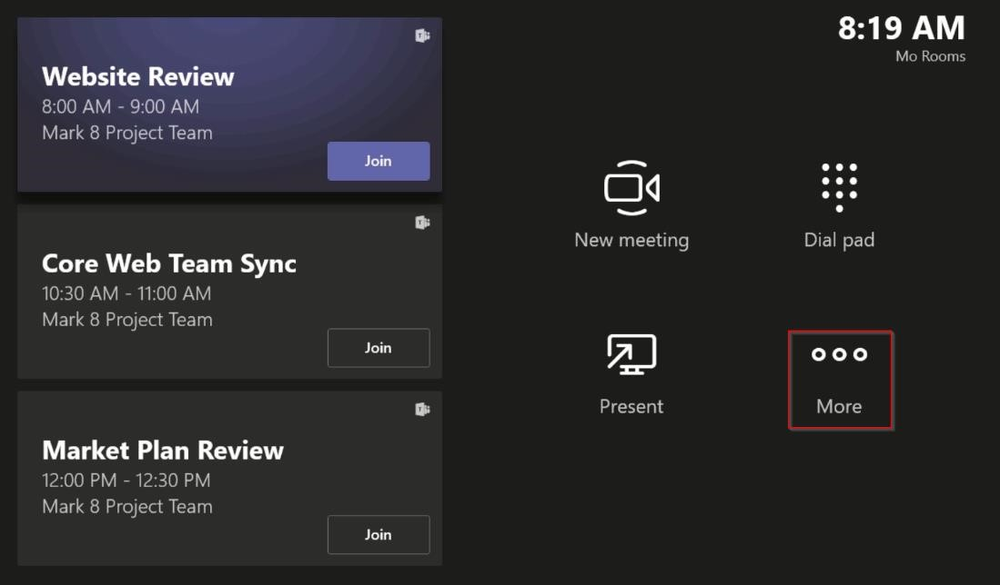
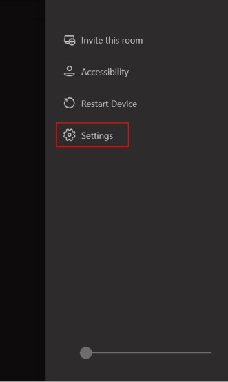
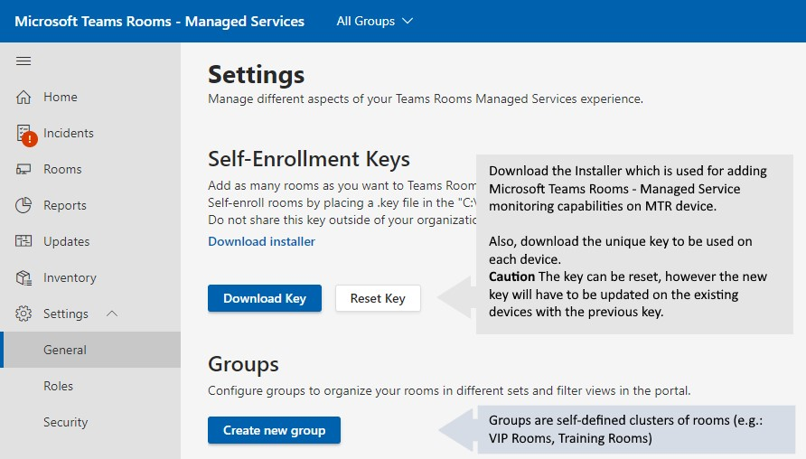

---
title: Microsoft Teams Rooms Premium-managed service
author: v-donnahill
ms.author: donnah007
manager: serdars
ms.reviewer:  
ms.topic: article
ms.tgt.pltfrm: cloud
ms.service: msteams
audience: Admin
ms.collection: 
  - M365-collaboration
  - m365initiative-meetings
appliesto: 
  - Microsoft Teams
ms.localizationpriority: medium
search.appverid: MET150
description: provide a view of the health of your meeting rooms.
f1keywords: 
---

This guide intents to provide detailed guidance for onboarding Microsoft Teams Rooms devices to the Microsoft Teams Rooms – Managed Services. Microsoft Teams Rooms – Managed Services It’s a cloud-based operations service managed by Microsoft experts and operated 24x7x365. 

# General Information  

## Supported Devices  
Please note that the Microsoft Teams Rooms – Managed Services monitoring service agent is for use with certified Microsoft Teams Room (MTR) systems and peripherals. 

## Performing operations as the Admin user of the MTR device 
Throughout this document, some configuration/installation procedures require you to login to the device as administrator. 

To login the device as administrator (local administrator): 

1. Ensure you Hang up any ongoing calls and return to the home screen. 
1. In the Microsoft Teams Room user interface, click the **More** icon then click **Settings** icon where you'll be prompted for the local Administrator password on the device (the default password is ***sfb***). 

 

 

1. Tap on **Settings** followed by tapping on the **Windows Settings** button to access windows as local administrator.  

 

From the list of users displayed in the Windows login screen, select the **Administrator** 

(or the respective local administrator of your device) 

 

Please note: If the computer is *domain joined*, choose **Other User**, then use **.\admin** as the user name – or the user name of the local administrator configured in the device.  

To return to the Microsoft Teams Room app after performing the necessary administrative tasks: 

1. From the Windows ***start menu***, sign out from the Admin account. 
1. Return to Microsoft Teams Room by selecting the user account icon on the far left side of the screen and then selecting **Skype**. 

Please note: If the Skype user is not listed, you might have to select other user and enter ***.\skype*** as the user name, and sign in. 

# Pre-requisites 

## Adding Proxy Settings (optional) 
1. Be sure you login as administrator – ensure the *Performing operations as the Admin user of the MTR device* steps are followed. 
1. In the Windows ***Search*** *box* (bottom left section of the screen), type in **cmd** (either long press the screen or right click, and choose ***Run as administrator***).  
1. Run the following command (double quotes at end of command are important):  
   1. If using single ***proxy server***:  bitsadmin /Util /SetIEProxy LOCALSYSTEM MANUAL\_PROXY <proxyserver>:<port> "" 

*Example:* bitsadmin /Util /SetIEProxy LOCALSYSTEM MANUAL\_PROXY contosoproxy.corp.net:8080 ""* 

1. If using ***pac*** file:  bitsadmin /Util /SetIEProxy LOCALSYSTEM AUTOSCRIPT <pac file url> "" 

*Example:* bitsadmin /Util /SetIEProxy LOCALSYSTEM AUTOSCRIPT http://contosoproxy.corp.net/proxy.pac "" 

## Enabling TPM Settings  
You may find that the TPM setting on an Intel NUC device is disabled. Below are instructions to enable TPM on these devices.  

1. Plug in keyboard to NUC device  
1. Restart device  
1. Rapidly press **F2** key to display BIOS screen  
1. Select **Advanced** option  
1. Select **Security** option  
1. On the right-hand side under security features, Enable **Intel Platform Trust Technology** option  
1. Press **F10** to save your settings  
1. Select **Yes** to the confirmation box  

## URLs Required for Communication  
**Please note:** All network traffic between the MTR devices agent and the Microsoft Teams Rooms – Managed Services service portal is SSL over port 443*.* 

The following hosts need to be allowed if you have traffic allowlist enabled within your enterprise environment: 

agent.rooms.microsoft.com 
global.azure-devices-provisioning.net  
gj3ftstorage.blob.core.windows.net  
iothubsgagwt5wgvwg6.azure-devices.net 
blobssgagwt5wgvwg6.blob.core.windows.net 
mmrstgnoamiot.azure-devices.net  
mmrstgnoamstor.blob.core.windows.net  
mmrprodapaciot.azure-devices.net 
mmrprodapacstor.blob.core.windows.net  
mmrprodemeaiot.azure-devices.net  
mmrprodemeastor.blob.core.windows.net  
mmrprodnoamiot.azure-devices.net  
mmrprodnoamstor.blob.core.windows.net  

# Process  
The Enrollment process involves a few steps:  

1. On the left navigation bar of the Microsoft Teams Rooms – Managed Services portal [(](http://portal.rooms.microsoft.com/)[http://portal.rooms.microsoft.com](http://portal.rooms.microsoft.com/)[)](http://portal.rooms.microsoft.com/), expand **Settings** and select **General**.  
1. Under *Self-Enrollment keys* section of the page, click **Download installer** hyperlink [(](https://aka.ms/serviceportalagentmsi)<https://aka.ms/serviceportalagentmsi>[)](https://aka.ms/serviceportalagentmsi) to download the monitoring agent software. 
1. Also under *Self-Enrollment keys* section, click **Download Key**. Place the key file under the **C:\Rigel** folder on each device you are enrolling.  
1. ***Optional*:** Setup proxy settings for the agent *– see* *previous section Adding Proxy Settings (optional)* 
1. Install the agent installer (downloaded in step 2) on Microsoft Teams Room (MTR) units, either by running the MSI locally on a Microsoft Teams Room device or via your normal means of publishing MSI applications on mass to devices within your environment (Group-Policy etc.)  
1. The room will appear in the portal within 5-10 minutes, if not please contact managedroomsupport@microsoft.com.  

 

## Installation  
After downloading the installer from Microsoft (either from the portal or by using the AKA.ms URL provided above), unzip its contents and you will find the **ManagedRoomsInstaller.msi**. 

There are two modes of installation – individual local machine install and mass deploy mode (usually via group policy of similar method). We recommend individual install for non-domain joined machines or for machines which you have no way of running MSI installers remotely.  

Due to the many varied ways in which customers can run MSI applications in mass deployment mode this document will only walk-through installation in individual mode.  

**NOTE:** The installer program flow is the same, no matter what mode is being run. The only slight difference is that the install does not request a user to press the next and close buttons in mass deploy mode.  

# Individual Device - Domain Joined Walkthrough  
As primary step, you must login the device as administrator – ensure the *Performing operations as the Admin user of the device* steps are followed. 

Next, as mentioned previously, copy the following files to the MTR device: 

- Place the ‘Self-Enrollment key’ (previously downloaded from the portal) on the **C:\Rigel** directory of the device. 
- Copy the **ManagedRoomsInstaller.msi** (previously downloaded from the portal or from the AKA.MS ) to the device  

On running the ***ManagedRoomsInstaller.msi***, you will see a License Agreement screen. After reading the agreement, check ***I accept the terms in the License Agreement*** and press the **Install** button.  

This will begin the Microsoft Teams Rooms – Managed Services monitoring software install. You will see a prompt for elevation (run as administrator). Select ***Yes*** button. The install will continue.  

During the installation procedure, a console window will open and begin the final stage of the Microsoft Teams Rooms – Managed Services monitoring software install.  Please allow this window to close on its own.  

Once the installation is complete, the wizard should display a “Finish” button.   

Please press **Finish**.  

## Completing Enrollment  
After the install is complete, wait 5-10 minutes and refresh the portal and the device will be listed, reported as *Onboarding* state. 

In *Onboarding* state, the status of the room is displayed and updated but it won't raise any alerts or create investigation tickets. 

***Click*** in the room and click **Enroll** button to start getting incident alerts, investigation tickets, or to report an incident: 

For any questions or issues, please open a customer reported incident in the portal or contact managedroomsupport@microsoft.com. 

# Unenroll and Uninstalling the monitoring software  
To unenroll the device, remove the monitoring agent from the MTR device: 

1. On the device being monitored, login the device as administrator – ensure the *Performing operations as the Admin user of the device* steps are followed. 
1. Download reset script from [aka.ms/MTRPDeviceOffBoarding](http://aka.ms/MTRPDeviceOffBoarding)
1. Extract the script somewhere on the device and copy path 
1. Open Powershell as administrator: In the Windows ***Search*** *box* (bottom left section of the screen), type ‘Powershell’ and right click ***Windows Powershell*** and select *“Run as Administrator”* and accept UAC prompt.* 
1. Type *Set-ExecutionPolicy –ExecutionPolicy RemoteSigned* and press enter then Y on next prompt.*  
1. Paste in or type out the full path to the unzipped offboarding script into the PowerShell window and press enter, like: 

*C:\Users\admin\Downloads\MTRP\_Device\_Offboarding\MTRP\_Device\_Offboarding.ps1*  

6. This will reset the device to user standard MTR updates and remove the MTRP monitoring agent and files 

7. From the left menu in the Microsoft Teams Rooms – Managed Services portal, select **Rooms**.  
8. In the list of rooms provided, ***Click*** in the room you want to unenroll and click **Unenroll** button to stop getting incident alerts, investigation tickets, or to report an incident for the room. 

# Troubleshooting Table  
**Note**: *All Microsoft Teams Rooms – Managed Services monitoring errors are logged on a specific Event Log file named **Microsoft Managed Rooms**.*  
### ***Application runtime log file location*** =  
C:\Windows\ServiceProfiles\LocalService\AppData\Local\ServicePortalAgent\ app-x.x.x\ServicePortalAgent\ServicePortal\_Verbose\_LogFile.log (Note: x.x.x = app version number)  

|**Symptom**  |**Recommended Procedure**  |
| :- | :- |
|
You receive an error message stating   

***ERROR: Please run this application with*** 

***elevated privileges***  
|Run the application with escalated privileges and try again  |
|  |  |
|
You receive an error message stating   

***TPM data cannot be found***  
|Ensure that you your device has TPM (Trusted Platform Module) turned on in its BIOS. This is usually found in the security settings of the device BIOS  |
|  |  |
|
You receive an error message  

` `***ERROR: Local user account named 'Admin' or ‘Skype’ not found***  
|Ensure that the user accounts exist on the certified Microsoft Teams Room systems device.  |
|  |  |
|You receive any error state messages that are not covered above  |Please provide a copy of your installation log to your Microsoft Teams System support agent.  |

