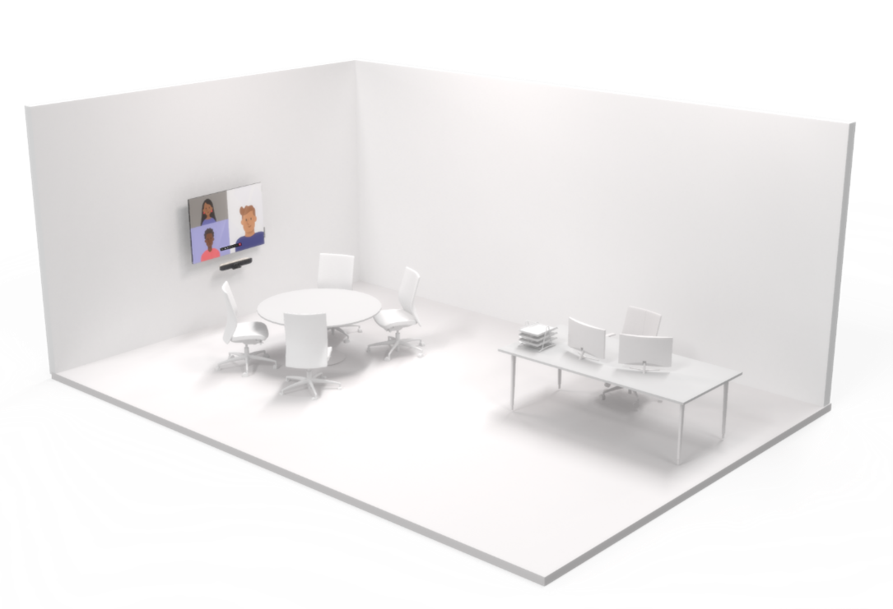
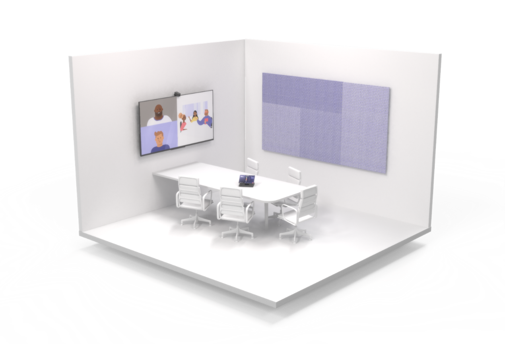
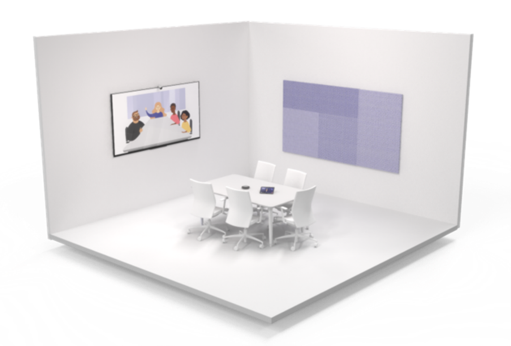
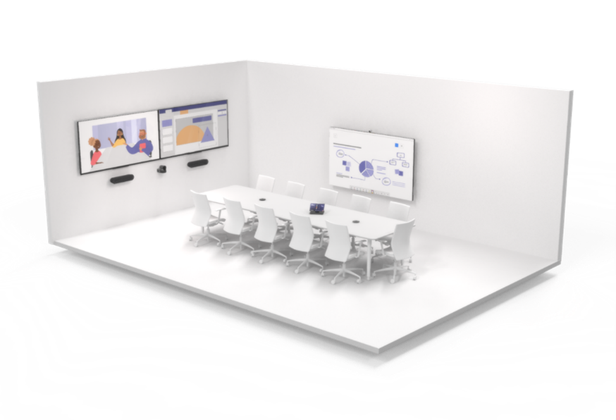
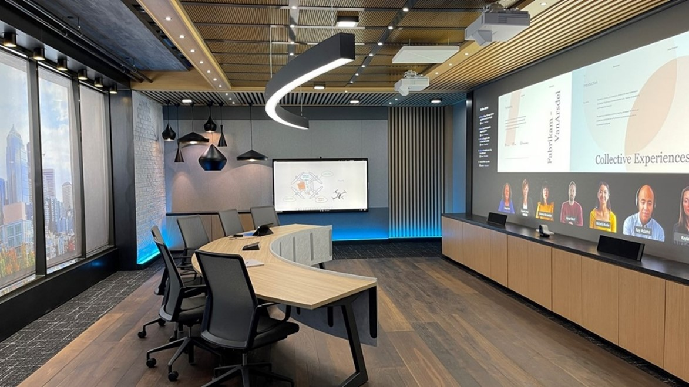
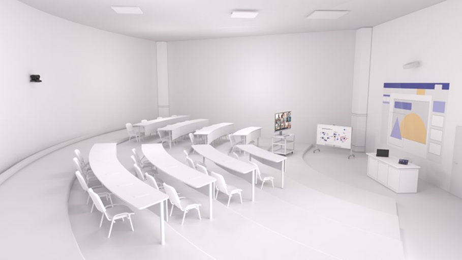

# Meeting room guidance for Teams

## Meeting behaviors 

### Usage - Cocreation and presentation

*Will the activities in the space focus on collaborative cocreation?*

Ease of cocreation lends itself to a layout and a technology deployment designed around user collaboration. The right space facilitates bridge users and the technology seamlessly and eliminate friction for even the most novice users. Teams devices are designed to be user-friendly enough for young students to navigate adeptly, and for educators to control and customize from first use.

*What about spaces where content sharing with both in-person and remote participants is the priority?*

This type of room prioritizes presentation and discussion. Content sharing and remote cocreation lend themselves to different physical layouts and technology experiences. A presentation-optimized space facilitates discussion and makes it easy for everyone to see and review shared content. 

*What if I need to do both in a single space?*

Remember, both types of rooms can handle both types of experiences when needed. Rooms can also be designed to accommodate both easily by having technology for each use. The important thing to remember is that no matter what space you are equipping, from a private office to a lecture hall, it needs to be Teams enabled.

## Layout – Furniture and space

**Presentation spaces**

Tables should be fixed and located in front-of-room displays. In smaller rooms, the tables may be attached to the wall, but in larger spaces, they must be separated to accommodate camera considerations.

**Cocreation spaces**

Tables and cocreation equipment can have flexible positions and should accommodate groups of people working at either the tables or the equipment.

**Combination presentation and cocreation spaces**

A combination of uses cases from other meeting scenarios can be combined to form multi-purpose rooms where presentation focused meetings as well as cocreation work can be achieved with equal efficiency, often simultaneously.

## Experience

*How do I achieve the best possible meeting experience in all my spaces?*

A great meeting experience is the result of using the best possible technology for a meeting space in ways that facilitate the exchange of ideas without being intrusive.

By having both Teams on all your personal devices and properly deployed Teams meeting room solutions in all your spaces, you will be able to facilitate the best possible meeting experience for every one of your users. As you adopt a plan to achieve this goal, you will need to address all your spaces in terms of both technological deployment and end-user guidance and training.

It’s normal when planning for a large-scale, company-wide rollout for it to happen in stages with some rooms seeing technology added at different times, or even certain components being installed earlier than others (such as deploying Teams panels for scheduling in every room in a particular building while installing Teams Room systems one floor or even room at a time).

Prepare your users to do this in stages to maximize your Teams meeting experience at every point along the way.

***Good experience – Personal devices alone in a meeting space***

You can start with this plan by addressing all your non-AV or non-collaboration-equipped meeting spaces. You can still take advantage of Teams in your meeting rooms, even if those meeting rooms have not yet had Teams devices installed.

A great bridge to a complete Teams room is to plan for meeting technology by either providing your individual users with Teams-certified audio devices for smaller rooms and groups, or deploying them in rooms ahead of a full Teams Room system for larger spaces meant for larger groups where a small device won’t cut it.

When these rooms are used, individual users can bring their own devices to share in the Teams meeting content and capture their expressions with their individual cameras. Users can then designate someone to be the single source of audio for the local group, connecting that personal device to the certified audio device, so that everyone (both local and remote) has a positive experience with meeting audio.

***Better experience – Meeting-rooms systems and no personal devices***

If you install Teams Room systems, or if you already have rooms that have already been deployed with appropriate Teams Room devices for their respective spaces, then you are well on your way to having great meeting experiences.

Your end users will be able to take advantage of the complete Teams room experience for their meetings, ensuring that everyone is able to join meetings easily and have great and audio and video.

***Best experience – Meeting-room systems used in parallel with personal devices***

Training your users to use technology in coordination leads to the most efficient and streamlined outcome. The best possible scenario is a combination of installed technology and personal devices.

The majority of meeting-room connectivity and audio-video work will be handled by the room systems, while individual users can join the same meeting with cameras on and audio off for a completely immersive experience.

Remote users will be able to see everyone clearly take part in the meeting beyond just speaking and content sharing.

Chat can remain dynamic with all participants, both local and remote, involved and engaged. Video sharing from both room systems and via individual cameras allows remote participants to feel engaged with every participant, even in spaces equipped with intelligent cameras.

Using Teams on all devices ensures that local room users and remote users feel equally engaged in meetings.

## Technology considerations

The right audio and video technology choices will help users get the most out of their Microsoft Teams meetings.

### Audio

Audio considerations are critical to ensure both remote and in-room participants can be clearly heard and understood. Microphone and speaker coverage must include every seat in the room without leaving gaps.

*What are the right audio devices for each space?*

A single source of audio for a space is required to ensure that there are no audio issues in a meeting room. 

Pairing the right microphone and speakers for each space will give the best possible results for being heard clearly without distraction.

-   In shared spaces, the options expand, but the same principles remain: meeting participants need to be heard and hear others clearly.

    -   All-in-one audio devices are easy-to-deploy, high-quality options for smaller spaces with a limited number of participants seated relatively close to the audio device.

    -   In larger spaces, the microphones and speakers separate to ensure maximum coverage across all participants in the space. Many solutions for medium- to large-sized rooms are available as part of a kit that requires no configuration, only physical installation of microphones and speakers.

    -   In the very largest and most complex spaces, solutions are available that allow for a variety of microphone and speaker types to be used together, such as capturing a lecturer and audience voice from a large hall while simultaneously bringing the call to everyone. These solutions are best achieved when deployed with a Microsoft partner who has expertise in the design and deployment of more technically involved solutions.

### Video

Video is equally important as audio. Capturing physical, non-verbal communication like facial expressions or gestures is as important as the classroom or meeting content to ensure maximum engagement and understanding. Rooms need to be equipped with the appropriate size of display so that everyone can experience the meeting properly, whether in the room or remote. This is why rooms also need to have the right camera coverage and field of view (FOV) to effectively capture all the in-room meeting participants for those joining remotely.

*What are the right cameras for each space?*

As important as good audio, high-quality video is a necessity for modern Teams collaboration. Technology for cameras has advanced significantly with high-quality cameras now available for all spaces.

-   Included cameras in devices like laptops and tablets should be used in all meetings to ensure that everyone is seen and hear. For users looking to bring a richer video experience to a personal space, external cameras represent a step up from embedded devices and can be used in a greater number of scenarios and configurations, ensuring that call participants share the best quality view of themselves. These devices easily install with simple USB connection found on every PC.

-   In shared spaces, the options and features expand. Smaller rooms may be covered by cameras included within all-in-one audio devices, such as soundbars. These cameras typically feature a wide field of view, ensuring that they capture every participant in the space in a single shot. Many of these cameras also feature things like intelligent framing of the image, so that the camera only shows the people in the meeting and not empty chairs, or people counting, to track and understand space utilization.

-   In larger rooms, cameras feature the technology needed to capture participants in a variety of locations at varying distances away. These cameras can capture groups or focus on specific individuals while maintaining great visual clarity. Devices that can track and feature only active speakers are regularly used in larger spaces so that many participants may be featured individually throughout a meeting as they contribute their thoughts.

## Examples

## Smaller meeting spaces 

### Private office with meeting space

|Usage: Presentation  |||
|----------|-----------|------------|
|**Layout**   |Typical Capacity       |3-4 people        |
||Typical Dimensions  |10ft X 10ft|
||Single or Dual Primary Display Recommended  |Single|
|**Audio**    |Recommended Audio    |Single front-of-room or tabletop device|
|**Video**    |Recommended Camera    |Short distance with ultra-wide field of view|
||	Minimum Display Size    | 46in|

Private offices are often designed with meeting spaces separate from the working area so that small meetings can be held with a mix of local and remote participants.

 

*The solution shown is:*

A huddle or focus room area inside of a larger private working space.

*Why this layout and device type?*

The layout of the space is designed to facilitate meetings with both local and remote participants.

The meeting table is physically separate from the private working space and the meeting-room technology to facilitate both meetings with local and remote participants.

The room features a single display sized so that all participants can clearly see all presented content and remote video participants clearly. It also features a soundbar-based Room system with an integrated intelligent camera. This system is easy to install and operate and provides great audio and video coverage for meetings in this type of space.

*Pictured here:*

-   Single display

-   All-in-one soundbar-based Room system

### Open spaces 

| **Usage: Cocreation**  ||                      |
|------------|--------------------------------------------|----------------------|
| **Layout** | Typical Capacity                           | 3-12 People          |
|            | Typical Dimensions                         | Depends on the space |
|            | Single or Dual Primary Display Recommended | Depends on the space |
| **Audio**  | Recommended Audio                          | Depends on the space |
| **Video**  | Recommended Camera                         | Depends on the space |
|            | Minimum Display Size                       | Depends on the space |

Open spaces, such as lounges and common areas, often feature collaboration technology for non-traditional meetings.

 

*The solution shown is:*

Two areas with Surface Hub devices positioned for interactive collaboration and creation options in a large, open space.

*Why this layout and device type?*

The counter-height table is positioned with a large Surface Hub device for use of a content-creation display as well as a Teams Room system for small meetings. Another Surface Hub device is set up on a cart to be moved around to casual seating areas for content creation. The furniture is laid out to be mixed use for both informal office conversation as well as impromptu co-working, giving options for all space types.

*Pictured here:*

-   Large wall-mounted Surface Hub

-   Cart-mounted mobile Surface Hub

### Focus/huddle room

|Usage: Presentation |||
|----------|-----------|------------|
|**Layout**   |Typical Capacity       |3-5 people        |
||Typical Dimensions  |10ft X 10ft|
||Single or Dual Primary Display Recommended  |Single|
|**Audio**    |Recommended Audio    |Single front-of-room or tabletop device|
|**Video**    |Recommended Camera    |Short distance with ultra-wide field of view|
||	Minimum Display Size    | 46in|

These spaces are ideal for small-group collaboration and discussion.

 

*The solution shown is:*

A huddle or focus room with the Microsoft Teams Room system for small-group collaboration.

*Why this layout and device type?*

The table is attached to the wall, which maximizes the flexibility of the space for various layouts. It ensures the Room System is the focus of the space. A mounted display sized for the room ensures everyone physically present can see remote meeting participants and/or a collaborative document. A room camera captures the room for remote participants. Because the room is a dedicated meeting space, a tabletop audio device makes sure all parties are heard.

*Pictured here:*

-   A Teams Room system for small rooms, easily installed

-   Single front-of-room display for remote participants and content to be shared

### Small traditional meeting rooms

|Usage: Presentation |||
|----------|-----------|------------|
|**Layout**   |Typical Capacity       |5-7 people        |
||Typical Dimensions  |10ft X 15ft|
||Single or Dual Primary Display Recommended  |Single|
|**Audio**    |Recommended Audio    |Single front-of-room or tabletop device|
|**Video**    |Recommended Camera    |Short distance with ultra-wide field of view|
||	Minimum Display Size    | 50in|

These spaces are ideal for small-group collaboration and discussion.

 

*The solution shown is:*

A small, traditionally laid-out meeting room with the Microsoft Teams Room system.

*Why this layout and device type?*

A more traditional meeting-room layout can be designed just as much for purely in-person meetings as for meetings with remote participants and content. The table is separated from the display wall and Room system. A mounted display sized for the room ensures everyone physically present can see remote meeting participants and/or a collaborative document. A room camera captures the room for remote participants. Because the room is a dedicated meeting space, a tabletop audio device makes sure all parties are heard.

*Pictured here:*

-   A Teams Room system for small rooms, easily installed

-   Single front-of-room display for remote participants and content to be shared

## Larger meeting spaces 

### Medium traditional meeting rooms

|Usage: Presentation and cocreation|||
|----------|-----------|------------|
|**Layout**   |Typical Capacity       |10-12 people        |
||Typical Dimensions  |15ft X 20ft|
||Single or Dual Primary Display Recommended  |Single or dual|
|**Audio**    |Recommended Audio|Installed audio with discrete tabletop or ceiling microphones and wall-mounted or ceiling-mounted speakers|
|**Video**    |Recommended Camera|Medium-long distance camera with Pan Tilt Zoom function and/or intelligent people-tracking capabilities|
||	Minimum Display Size    | 55in for dual, larger for single|

This medium room is ideal for conferences and group collaboration, especially in existing spaces that already feature a classic meeting-room layout.

 

*The solution shown is:*

A medium-sized meeting room with dual front-of-room displays for various layouts of people and content with annotation and collaboration for the Surface Hub 2.

*Why this layout and device type?*

A more traditional meeting-room layout can be designed just as much for purely in-person meetings as for meetings with remote participants and content. The table is separated from the display wall and Room system. Multiple displays ensure that remote participants have a prominent space in the physical room and that any collaborative documents are visible. Mounted speakers give remote attendees an “in-the-room” voice. A mounted camera ensures all the physical meeting participants are captured.

*Pictured here:*

-   Microsoft Teams Room for Windows system with dual front-of-room displays for high visibility of remote participants and shared content

-   An optional Surface Hub 2 for annotation and whiteboarding

-   A larger, separated audio and camera solution installed for maximum coverage of participants in the larger space. Table microphones and wall-mounted speakers ensure that is everyone is heard in Teams calls

### Large traditional meeting rooms

|Usage: Presentation and cocreation|||
|----------|-----------|------------|
|**Layout**   |Typical Capacity       |12-20 people        |
||Typical Dimensions  |15ft X 30ft|
||Single or Dual Primary Display Recommended  |Single or dual|
|**Audio**    |Recommended Audio|Installed audio with discrete tabletop or ceiling microphones and wall-mounted or ceiling-mounted speakers|
|**Video**    |Recommended Camera|Medium-long distance camera with Pan Tilt Zoom function and/or intelligent people-tracking capabilities|
||	Minimum Display Size    | 65in for dual, larger for single|

A large-sized room is ideal for conferences and group collaboration, especially in existing spaces that already feature a classic meeting-room layout.

 

*The solution shown is:*

A large-sized meeting room with dual front-of-room displays for various layouts of people and content with annotation and collaboration for the Surface Hub 2.

*Why this layout and device type?*

A more traditional meeting-room layout can be designed just as much for purely in-person meetings as for meetings with remote participants and content. The table is separated from the display wall and Room system. Multiple displays ensure that remote participants have a prominent space in the physical room and that any collaborative documents are visible. Mounted speakers give remote attendees an “in-the-room” voice. A mounted camera ensures all the physical meeting participants are captured.

*Pictured here:*

-   Microsoft Teams Room for Windows system with dual front-of-room displays for high visibility of remote participants and shared content

-   Optional Surface Hub 2 for annotation and whiteboarding

-   A larger, separated audio and camera solution installed to get maximum coverage of participants in the larger space. Table microphones and wall-mounted speakers ensure that everyone is heard in Teams calls

### Extra-large traditional meeting rooms/boardrooms

|Usage: Presentation and cocreation|||
|----------|-----------|------------|
|**Layout**   |Typical Capacity       |25-40 people        |
||Typical Dimensions  |28ft X 33ft|
||Single or Dual Primary Display Recommended  |Single or dual|
|**Audio**    |Recommended Audio|Installed ceiling or table microphones and speakers with a Digital Signal Processor (DSP)|
|**Video**    |Recommended Camera|Long-distance camera with Pan Tilt Zoom function and/or intelligent people-tracking capabilities|
||	Minimum Display Size    | 75in for dual, larger for single|

This type of space typically includes an extra-large-sized layout featuring a meeting-room table as well as an audience seating area with dual front-of-room displays.

 

*The solution shown is:*

An extra-large-sized meeting room with dual front-of-room displays for various layouts of people and content with annotation and collaboration for the Surface Hub 2.

*Why this layout and device type?*

This space features a principal meeting-room table for many meeting participants as well as an audience seating area for extra capacity for local meeting attendees. A dual large display gives remote participants a physical presence within the room. Installed audio in the ceiling means audio coverage for all participants in every part of the room, even those seated away from the main meeting table. A collaborative white-board screen is dedicated to content for both in-room and remote participants to be part of any creative ideation.

*Pictured here:*

-   Microsoft Teams Room for Windows system with separated dual displays

-   Optional Surface Hub 2 for annotation and whiteboarding

-   Installed audio-visual components featuring ceiling-mounted audio devices and a camera solution installed to get maximum coverage of participants throughout the space

### Panoramic meeting rooms

|Usage: Presentation and cocreation|||
|----------|-----------|------------|
|**Layout**   |Typical Capacity       |6-12 people        |
||Typical Dimensions  |Depends on the space|
||Single or Dual Primary Display Recommended  |Dual traditional displays or dual-edged blended projectors|
|**Audio**    |Recommended Audio|Installed ceiling or table microphones and speakers that can support directional audio|
|**Video**    |Recommended Camera|Long-distance camera with ultra-wide field of view and intelligent people tracking  |
||	Minimum Display Size    | Depends on the space|

This space is dedicated to the most immersive Teams meeting experience.

 

*The solution shown is:*

A meeting room, oriented with the table facing a panorama of blended displays, ensuring that all users get the best possible view of meeting participants and content.

*Why this layout and device type?*

A panoramic table layout is designed for maximum visibility and engagement with remote participants and content. Large, blended displays allow for an immersive feeling, with all chairs facing the displays and able to follow along. Spatial audio means it feels like remote participants are in the room with local participants based on their position on the front-of-room screen.

*Pictured here:*

-   Microsoft Teams Room for Windows system with two edge-blended projected displays, creating an immersive front-of-room experience designed specifically for Teams meetings

-   Surface Hub 2 for annotation and whiteboarding

-   Installed audio-visual components featuring ceiling-mounted and front-of-room audio devices for maximum coverage of participants throughout the space with a consideration for spatial audio

-   An intelligent, ultrawide-angle front-of-room camera to capture every participant in the space

## Non-traditional meeting spaces 

### Multi-purpose spaces

|Usage: Presentation and cocreation|||
|----------|-----------|------------|
|**Layout**   |Typical Capacity       |Custom        |
||Typical Dimensions  |Custom|
||Single or Dual Primary Display Recommended  |Custom|
|**Audio**    |Recommended Audio|Installed ceiling or table microphones and speakers that can support directional audio|
|**Video**    |Recommended Camera|Long-distance camera with ultra-wide field of view and intelligent people tracking |
||	Minimum Display Size    |Custom|

Teams can be implemented in almost any educational or multi-purpose space you can think of. Libraries, mixed-use presentation and collaboration spaces, café spaces, and open-air spaces can all be outfitted with a Teams system or Teams devices.

 

*An example multi-purpose space is:*

A room system with a large, projector-based front-of-room display, multiple touch consoles for operation, and multiple Surface Hub 2 devices for a wide range of uses.

*Devices include:*

-   Crestron C100 Microsoft Teams Room for Windows system, featuring multiple Crestron touch consoles, with a single, large front-of-room projector and screen for high visibility of remote participants and shared content

-   Optional Surface Hub 2 for annotation and whiteboarding

-   Installed audio-visual components featuring ceiling-mounted audio devices and a camera solution installed for maximum coverage of participants throughout the space

### Classrooms

|Usage: Presentation and cocreation|||
|----------|-----------|------------|
|**Layout**   |Typical Capacity       |Custom        |
||Typical Dimensions  |Custom|
||Single or Dual Primary Display Recommended  |Custom|
|**Audio**    |Recommended Audio|Installed audio with discrete tabletop or ceiling microphones and wall-mounted or ceiling-mounted speakers|
|**Video**    |Recommended Camera|Medium-long distance camera with Pan Tilt Zoom function and/or intelligent people-tracking capabilities|
||	Minimum Display Size    |Custom|

Classrooms, including traditional and reverse classrooms, require active engagement from everyone present. Effective instruction, discussion, and collaboration among many parties is key.

 

*The solution shown is:*

A classroom designed for both in-person and remote student participants with a layout that accommodates a single educator addressing both groups simultaneously.

*Why this layout and device type?*

A large display gives remote participants a physical presence within the room, along with front-of-the-room speakers that allow their voices to be heard by all, even by those at desks furthest from the source. Microphones are situated at the front of the room and throughout the space so teachers and students can move around the room and still be heard. A presentation screen is dedicated to content for both in-room and remote participants.

*Pictured here:*

-   Microsoft Teams Room for Windows system with separated dual displays, a single cart or stand-based display showing the remote participants for the educator to see clearly, and a separate presentation screen for the educational content shared for both local and remote students to observe

-   Logitech Rally Plus kit with speakers and camera at the front of the room as well as microphones at the front and distributed throughout the classroom 

### Lecture halls and auditoriums

|Usage: Presentation and cocreation|||
|----------|-----------|------------|
|**Layout**   |Typical Capacity       |Custom        |
||Typical Dimensions  |Custom|
||Single or Dual Primary Display Recommended  |Custom|
|**Audio**    |Recommended Audio|Installed audio with discrete tabletop or ceiling microphones and wall-mounted or ceiling-mounted speakers|
|**Video**    |Recommended Camera|Medium-long distance camera with Pan Tilt Zoom function and/or intelligent people-tracking capabilities|
||	Minimum Display Size    |Custom|

Much like classrooms, lecture halls contain numerous students who must focus on an educator and any information they’re presenting. However, lecture halls generally don’t require the same amount of interaction among students. The focus is on information, not collaboration.

 

*The solution shown is:*

A lecture hall designed for both in-person and remote student participants with a layout that accommodates a single educator addressing both groups simultaneously, as well as creating and annotating content from a touch surface.

*Why this layout and device type?*

Remote participants can see the same field of view that in-person participants have via the mounted camera. The lecturer can see the remote students via their cameras on a display screen. A dedicated presentation screen and a touch-surface screen for whiteboarding display the lecturer’s educational material for all. A ceiling-tile microphone and a powerful speaker make sure the lecturer and any student questions are heard clearly.

*Pictured here:*

-   Microsoft Teams Room for Windows System with separated dual displays, a single cart- or stand-based display showing the remote participants for the educator to see clearly, and a separate presentation screen for the educational content shared into the call for both local and remote students to observe

-   Optional Surface Hub 2 for annotation and whiteboarding

-   Installed audio-visual components featuring ceiling-mounted audio devices and a camera solution installed for maximum coverage of participants throughout the space